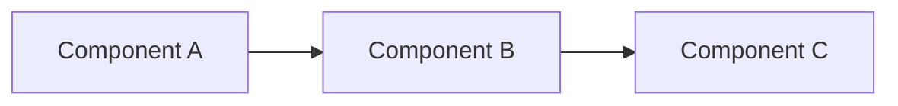

# Workflow Templates

> **Version:** 1.0.0 | **Last Updated:** 2026-06-03 | **Status:** Active
> **Audience:** AI Agents, Human Developers

## Workflow Types

### 1. Feature Development Workflow

```yaml
name: Feature Development
description: Complete feature development lifecycle
stages:
  - planning
  - implementation
  - testing
  - review
  - deployment
  - monitoring
```

#### Stage 1: Planning
```markdown
## Feature: [Feature Name]

### Requirements
- [ ] Functional requirement 1
- [ ] Functional requirement 2
- [ ] Non-functional requirement 1

### Technical Design


### API Changes
```http
POST /api/v1/new-endpoint
{
  "field": "value"
}
```

### Database Changes
```prisma
model NewModel {
  id String @id
  // New fields
}
```

### Testing Plan
- Unit tests: X files
- Integration tests: Y endpoints
- Load tests: Z concurrent users

### Documentation
- [ ] API docs
- [ ] User guide
- [ ] Architecture decision record
```

#### Stage 2: Implementation
```markdown
## Implementation Checklist

### Backend
- [ ] Database schema
- [ ] API endpoints
- [ ] Business logic
- [ ] Error handling
- [ ] Input validation

### Frontend
- [ ] UI components
- [ ] State management
- [ ] API integration
- [ ] Error handling

### Infrastructure
- [ ] Environment variables
- [ ] Docker configuration
- [ ] CI/CD pipeline

### Code Quality
- [ ] Linting passes
- [ ] Type checking passes
- [ ] Tests written
- [ ] Documentation updated
```

#### Stage 3: Testing
```markdown
## Testing Checklist

### Unit Tests
- [ ] Core logic tests
- [ ] Edge case tests
- [ ] Error handling tests

### Integration Tests
- [ ] API endpoint tests
- [ ] Database integration tests
- [ ] External service tests

### Load Tests
- [ ] Performance baseline
- [ ] Stress testing
- [ ] Soak testing

### Security Tests
- [ ] Input validation
- [ ] Authentication
- [ ] Authorization
```

#### Stage 4: Review
```markdown
## Code Review Checklist

### Code Quality
- [ ] Follows style guide
- [ ] No code smells
- [ ] Proper error handling
- [ ] Good variable names

### Testing
- [ ] Tests are comprehensive
- [ ] Edge cases covered
- [ ] No flaky tests

### Documentation
- [ ] Code comments
- [ ] API documentation
- [ ] README updated

### Security
- [ ] No secrets in code
- [ ] Input validation
- [ ] Proper authentication
```

#### Stage 5: Deployment
```markdown
## Deployment Checklist

### Pre-deployment
- [ ] All tests passing
- [ ] Documentation updated
- [ ] Changelog updated
- [ ] Version bumped

### Deployment
- [ ] Blue/green deployment
- [ ] Feature flags configured
- [ ] Monitoring enabled
- [ ] Rollback plan ready

### Post-deployment
- [ ] Smoke tests pass
- [ ] Monitoring shows normal
- [ ] User feedback collected
```

#### Stage 6: Monitoring
```markdown
## Monitoring Checklist

### Metrics
- [ ] Response time
- [ ] Error rate
- [ ] Throughput
- [ ] Resource usage

### Alerts
- [ ] Error rate > threshold
- [ ] Response time > threshold
- [ ] Resource usage > threshold

### Logs
- [ ] Error logs
- [ ] Access logs
- [ ] Audit logs
```

---

### 2. Bug Fix Workflow

```yaml
name: Bug Fix
description: Bug investigation and resolution
stages:
  - detection
  - investigation
  - resolution
  - verification
  - prevention
```

#### Stage 1: Detection
```markdown
## Bug Report

### Summary
> One-line description

### Steps to Reproduce
1. Step 1
2. Step 2
3. Step 3

### Expected Behavior
> What should happen

### Actual Behavior
> What actually happens

### Environment
- OS: macOS 14.0
- Python: 3.13
- Node: 20.x

### Logs
```
Error message here
```
```

#### Stage 2: Investigation
```markdown
## Investigation Checklist

### Reproduce
- [ ] Bug reproduced locally
- [ ] Environment identified
- [ ] Steps confirmed

### Diagnose
- [ ] Error logs analyzed
- [ ] Stack trace reviewed
- [ ] Variables inspected
- [ ] Database state checked

### Root Cause
- [ ] Root cause identified
- [ ] Impact assessed
- [ ] Related issues found
```

#### Stage 3: Resolution
```markdown
## Fix Implementation

### Code Changes
```diff
- const broken = doSomething();
+ const fixed = doSomethingElse();
```

### Files Modified
- `src/lib/file.ts:45` - Main fix
- `src/__tests__/file.test.ts:23` - Test added

### Testing
- [ ] Unit test added
- [ ] Integration test updated
- [ ] Manual testing done
```

#### Stage 4: Verification
```markdown
## Verification Checklist

### Functional
- [ ] Bug is fixed
- [ ] No regressions
- [ ] Edge cases handled

### Performance
- [ ] No performance impact
- [ ] Memory usage stable

### Security
- [ ] No security issues
- [ ] Input validation updated
```

#### Stage 5: Prevention
```markdown
## Prevention Measures

### Immediate
- [ ] Test added for this case
- [ ] Monitoring added
- [ ] Documentation updated

### Long-term
- [ ] Similar code reviewed
- [ ] Linting rules added
- [ ] CI/CD enhanced
```

---

### 3. Memory System Workflow

```yaml
name: Memory System
description: Knowledge extraction and maintenance
stages:
  - extraction
  - validation
  - storage
  - query
  - maintenance
```

#### Stage 1: Extraction
```markdown
## Extraction Checklist

### Automated
- [ ] Run pipeline: `python memory_pipeline.py run`
- [ ] Check logs: `AxiomID.Memory/memory_pipeline/logs/`
- [ ] Verify outputs in respective directories

### Manual Review
- [ ] Review extracted decisions
- [ ] Verify lesson accuracy
- [ ] Confirm failure analysis
- [ ] Update confidence scores
```

#### Stage 2: Validation
```markdown
## Validation Checklist

### Automated
- [ ] Run validation: `python memory_pipeline.py run --mode validation`
- [ ] Check drift detection
- [ ] Verify dead code analysis

### Manual Review
- [ ] Review validation results
- [ ] Confirm accuracy
- [ ] Update status if needed
```

#### Stage 3: Storage
```markdown
## Storage Checklist

### File Organization
- [ ] Files in correct directories
- [ ] Frontmatter complete
- [ ] Links verified
- [ ] Tags applied

### State Management
- [ ] State files updated
- [ ] History maintained
- [ ] Health metrics recorded
```

#### Stage 4: Query
```markdown
## Query Patterns

### Simple Query
```bash
# Find decisions about authentication
grep -r "domains:.*authentication" Amrikyy.Memory/02_Decisions/

# Find high-confidence lessons
grep -r "confidence: 0.9" Amrikyy.Memory/03_Lessons/
```

### Complex Query
```python
# Query pipeline state
python memory_pipeline.py status

# View execution graph
python memory_pipeline.py graph

# Check specific tool state
python memory_pipeline.py state
```

### Agent Query
```json
{
  "query": "How does authentication work?",
  "context": "debugging 401 errors",
  "filters": {
    "type": ["decision", "lesson"],
    "domains": ["authentication"],
    "confidence": 0.8
  }
}
```

#### Stage 5: Maintenance
```markdown
## Maintenance Schedule

### Daily
- [ ] Check pipeline health
- [ ] Review error logs
- [ ] Verify state consistency

### Weekly
- [ ] Run full pipeline
- [ ] Review extracted knowledge
- [ ] Update confidence scores

### Monthly
- [ ] Clean up old sessions
- [ ] Archive deprecated items
- [ ] Update documentation

### Quarterly
- [ ] Review pipeline performance
- [ ] Optimize tool execution
- [ ] Update tool contracts
```

---

### 4. Agent Onboarding Workflow

```yaml
name: Agent Onboarding
description: New agent setup and training
stages:
  - setup
  - training
  - validation
  - deployment
```

#### Stage 1: Setup
```markdown
## Agent Setup Checklist

### Environment
- [ ] Python 3.13 installed
- [ ] Node.js 20.x installed
- [ ] Dependencies installed
- [ ] Environment variables set

### Configuration
- [ ] Agent credentials created
- [ ] Permissions configured
- [ ] Memory limit set
- [ ] Mode selected (AUTONOMOUS/SUPERVISED/MANUAL)

### Tools
- [ ] Pipeline tools accessible
- [ ] Query tools configured
- [ ] Monitoring enabled
```

#### Stage 2: Training
```markdown
## Agent Training Checklist

### Knowledge Base
- [ ] Read AMRIKYY_KNOWLEDGE_BASE.md
- [ ] Review DEC-XXX decisions
- [ ] Study LESSON-XXX lessons
- [ ] Understand FAIL-XXX failures

### Tools
- [ ] Run pipeline in safe mode
- [ ] Query memory system
- [ ] Generate reports
- [ ] Handle errors

### Workflows
- [ ] Feature development workflow
- [ ] Bug fix workflow
- [ ] Memory system workflow
```

#### Stage 3: Validation
```markdown
## Agent Validation Checklist

### Knowledge
- [ ] Can explain architecture
- [ ] Understands conventions
- [ ] Knows limitations

### Skills
- [ ] Can use pipeline tools
- [ ] Can query memory system
- [ ] Can generate reports
- [ ] Can handle errors

### Safety
- [ ] Follows security practices
- [ ] Respects rate limits
- [ ] Handles secrets properly
```

#### Stage 4: Deployment
```markdown
## Agent Deployment Checklist

### Pre-deployment
- [ ] All validation passed
- [ ] Documentation updated
- [ ] Monitoring configured

### Deployment
- [ ] Agent registered
- [ ] Permissions granted
- [ ] Memory access enabled

### Post-deployment
- [ ] Monitoring active
- [ ] Feedback collected
- [ ] Performance monitored
```

---

### 5. Incident Response Workflow

```yaml
name: Incident Response
description: Production incident handling
stages:
  - detection
  - triage
  - investigation
  - resolution
  - post-mortem
```

#### Stage 1: Detection
```markdown
## Incident Detection

### Sources
- [ ] Monitoring alerts
- [ ] User reports
- [ ] Automated tests
- [ ] Log analysis

### Initial Assessment
- [ ] Severity determined
- [ ] Impact assessed
- [ ] Team notified
```

#### Stage 2: Triage
```markdown
## Incident Triage

### Severity Levels
- **P0:** Complete outage
- **P1:** Major feature broken
- **P2:** Minor feature broken
- **P3:** Cosmetic issue

### Actions
- [ ] Acknowledge alert
- [ ] Join incident channel
- [ ] Start timeline
```

#### Stage 3: Investigation
```markdown
## Investigation Checklist

### Data Collection
- [ ] Error logs collected
- [ ] Metrics reviewed
- [ ] Changes identified
- [ ] Timeline established

### Root Cause
- [ ] Root cause identified
- [ ] Impact quantified
- [ ] Fix designed
```

#### Stage 4: Resolution
```markdown
## Resolution Checklist

### Fix Implementation
- [ ] Fix implemented
- [ ] Tests added
- [ ] Documentation updated

### Deployment
- [ ] Fix deployed
- [ ] Monitoring confirms
- [ ] Users notified
```

#### Stage 5: Post-mortem
```markdown
## Post-mortem Template

### Timeline
- **Detection:** When detected
- **Triage:** When triaged
- **Investigation:** Key findings
- **Resolution:** When fixed
- **Post-mortem:** When completed

### Impact
- **Duration:** X hours
- **Users affected:** Y users
- **Revenue impact:** $Z

### Root Cause
> Technical explanation

### Resolution
> What was done

### Prevention
1. Prevention measure 1
2. Prevention measure 2
3. Prevention measure 3

### Lessons
1. Lesson 1
2. Lesson 2
3. Lesson 3
```

---

## Workflow Automation

### Git Hooks

#### Post-commit Hook
```bash
#!/bin/bash
# Amrikyy Memory Pipeline - post-commit hook

set -e

PROJECT_ROOT="$(cd "$(dirname "$0")/../.." && pwd)"
MEMORY_DIR="$PROJECT_ROOT/Amrikyy.Memory"

# Run extraction pipeline
cd "$PROJECT_ROOT"
python "$MEMORY_DIR/memory_pipeline.py" run --mode extraction --quiet 2>/dev/null || true

# Log the trigger
echo "$(date -u +%Y-%m-%dT%H:%M:%SZ) | post-commit" >> "$MEMORY_DIR/memory_pipeline/logs/git-hooks.log"
```

#### Pre-commit Hook
```bash
#!/bin/bash
# Amrikyy Memory Pipeline - pre-commit hook

set -e

PROJECT_ROOT="$(cd "$(dirname "$0")/../.." && pwd)"
MEMORY_DIR="$PROJECT_ROOT/Amrikyy.Memory"

# Run validation pipeline
cd "$PROJECT_ROOT"
python "$MEMORY_DIR/memory_pipeline.py" run --mode validation --quiet 2>/dev/null

# Check exit code
if [ $? -ne 0 ]; then
    echo "❌ Memory system validation failed"
    exit 1
fi
```

### Cron Jobs

#### Daily Full Pipeline
```bash
# Run daily at 3 AM
0 3 * * * cd /path/to/project && python AxiomID.Memory/memory_pipeline.py run --mode full --quiet 2>/dev/null
```

#### Hourly Validation Check
```bash
# Run hourly
0 * * * * cd /path/to/project && python AxiomID.Memory/memory_pipeline.py run --mode validation --quiet 2>/dev/null
```

### CI/CD Integration

#### GitHub Actions
```yaml
name: Memory Pipeline

on:
  push:
    branches: [main]
  pull_request:
    branches: [main]

jobs:
  pipeline:
    runs-on: ubuntu-latest
    steps:
      - uses: actions/checkout@v3
      
      - name: Set up Python
        uses: actions/setup-python@v4
        with:
          python-version: '3.13'
      
      - name: Run Pipeline
        run: |
          python Amrikyy.Memory/memory_pipeline.py run --mode validation
      
      - name: Check Results
        run: |
          python Amrikyy.Memory/memory_pipeline.py status
```

---

## Metrics and Monitoring

### Pipeline Metrics
```json
{
  "pipeline": {
    "total_runs": 100,
    "success_rate": 0.95,
    "average_duration_ms": 1234,
    "tools": {
      "semantic_indexer": {
        "success_rate": 0.98,
        "average_duration_ms": 500
      },
      "ts_scanner": {
        "success_rate": 0.99,
        "average_duration_ms": 300
      }
    }
  }
}
```

### Agent Metrics
```json
{
  "agent": {
    "queries_per_day": 50,
    "success_rate": 0.92,
    "average_response_time_ms": 150,
    "knowledge_coverage": 0.85
  }
}
```

### System Health
```json
{
  "health": {
    "score": 98.5,
    "tools_healthy": 10,
    "tools_degraded": 1,
    "tools_broken": 0,
    "last_incident": "2026-06-01T00:00:00Z"
  }
}
```

---

## Best Practices

### 1. Consistency
- Use same workflow for same type of task
- Follow templates exactly
- Document deviations

### 2. Communication
- Update status regularly
- Notify team of blockers
- Share progress

### 3. Quality
- Test before marking complete
- Review before merging
- Verify before deploying

### 4. Documentation
- Document decisions
- Record lessons learned
- Update knowledge base

### 5. Monitoring
- Monitor key metrics
- Set up alerts
- Review regularly
