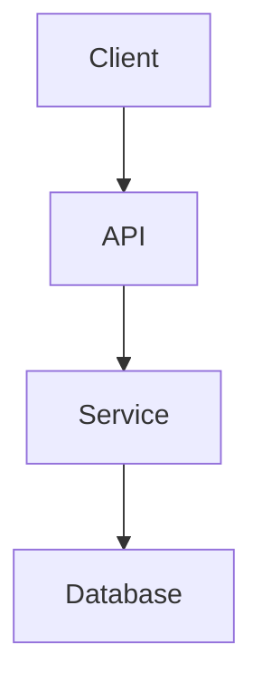

# Expert Writing Style Guide

> **Version:** 1.0.0 | **Last Updated:** 2026-06-03 | **Status:** Active
> **Audience:** AI Agents, Human Developers, Technical Writers

## Core Principles

### 1. Precision Over Speed
```text
❌ "The auth system handles login"
✅ "AxiomID authenticates agents via JWT tokens with RS256 signing"
```

### 2. Evidence Over Opinion
```text
❌ "Performance is good"
✅ "P95 latency: 45ms, throughput: 1200 req/s"
```

### 3. Action Over Description
```text
❌ "This file contains configuration"
✅ "Edit this file to change pipeline behavior"
```

### 4. Context Over Isolation
```text
❌ "Use bcrypt for hashing"
✅ "Use bcrypt (cost factor 12) for API keys, scrypt for passwords"
```

---

## Document Types

### 1. DEC-XXX (Decisions)

```markdown
---
type: decision
status: active
importance: high
domains:
  - authentication
confidence: 0.95
verification: tests
files:
  - src/lib/auth.ts
  - src/middleware.ts
related:
  - LESSON-001
created: 2026-06-03
updated: 2026-06-03
tags:
  - architecture
  - security
---

# DEC-001: Use JWT for Agent Authentication

## Status
**Active** | Proposed: 2026-06-01 | Approved: 2026-06-02

## Context
Agents need stateless authentication for API calls.

## Decision
Use JWT tokens with RS256 signing via AxiomID.

## Consequences
### Positive
- Stateless, scalable
- Industry standard
- Easy integration

### Negative
- Token rotation complexity
- Key management overhead

## Alternatives Considered
### Session-based Auth
- **Rejected:** Stateful, doesn't scale
- **Reason:** Agent calls are distributed

## Implementation
```typescript
// src/lib/auth.ts:45
export async function authenticateAgent(
  credentials: AgentCredentials
): Promise<AuthResult> {
  // Implementation
}
```

## Verification
- [x] Unit tests: `src/__tests__/auth.test.ts`
- [x] Integration tests: `src/__tests__/api/auth.test.ts`
- [ ] Load testing: Pending

## Related
- [[LESSON-001]]: JWT expiry handling
- [[FACT-001]]: Prisma schema for tokens
```

### 2. LESSON-XXX (Lessons Learned)

```markdown
---
type: lesson
status: active
importance: medium
domains:
  - api
  - debugging
confidence: 0.90
verification: runtime
files:
  - src/app/api/agent/route.ts
related:
  - DEC-001
created: 2026-06-03
updated: 2026-06-03
tags:
  - debugging
  - api
---

# LESSON-001: JWT Expiry Must Be Validated Server-Side

## Summary
Client-side expiry validation is unreliable.

## Context
Agents reported 401 errors despite valid tokens.

## Root Cause
Clock skew between client and server caused premature expiry validation.

## Solution
```typescript
// Always validate expiry server-side
const tokenExp = jwt.decode(token).exp;
if (Date.now() / 1000 > tokenExp + CLOCK_SKEW_BUFFER) {
  throw new TokenExpiredError();
}
```

## Prevention
1. Always validate tokens server-side
2. Add 30-second buffer for clock skew
3. Monitor token refresh failures

## Related
- [[DEC-001]]: JWT authentication decision
- [[FAIL-001]]: Initial auth failure
```

### 3. FAIL-XXX (Failure Analysis)

```markdown
---
type: failure
status: active
importance: high
domains:
  - authentication
  - pi
confidence: 0.95
verification: tests
files:
  - src/lib/passport-crypto.ts
related:
  - DEC-001
  - LESSON-001
created: 2026-06-03
updated: 2026-06-03
tags:
  - bug
  - security
---

# FAIL-001: Passport Signature Verification Failed

## Status
**Resolved** | Detected: 2026-06-01 | Fixed: 2026-06-02

## Impact
- **Severity:** Critical
- **Scope:** All agent authentication
- **Duration:** 4 hours

## Symptoms
```
Error: Signature verification failed
  at verifyAgentSignature (passport-crypto.ts:78)
  at authenticateAgent (auth.ts:45)
```

## Root Cause
Base64url encoding was using standard Base64 instead of URL-safe variant.

## Fix
```typescript
// Before (broken)
const signature = Buffer.from(rawSignature).toString('base64');

// After (fixed)
const signature = Buffer.from(rawSignature).toString('base64url');
```

## Prevention
1. Added test for signature round-trip
2. Updated CI to test with special characters
3. Added monitoring for verification failures

## Lessons
1. Always use URL-safe encoding for JWT components
2. Test with edge cases (special characters, unicode)
3. Monitor authentication error rates

## Related
- [[DEC-001]]: JWT authentication
- [[LESSON-001]]: Expiry validation
```

### 4. FACT-XXX (Architecture Facts)

```markdown
---
type: fact
status: active
importance: high
domains:
  - database
  - schema
confidence: 1.0
verification: manual
files:
  - prisma/schema.prisma
related:
  - DEC-001
created: 2026-06-03
updated: 2026-06-03
tags:
  - prisma
  - schema
---

# FACT-001: UserAgent Model Fields

## Summary
Prisma UserAgent model has specific fields.

## Schema
```prisma
model UserAgent {
  id            String      @id @default(cuid())
  publicId     String      @unique
  name         String
  status       AgentStatus @default(ACTIVE)
  mode         AgentMode   @default(AUTONOMOUS)
  personaId   String?
  publicKey   String?
  permissions Json?
  apiKeyHash  String?
  lastActive  DateTime?
  memoryLimit Int?
  createdAt   DateTime    @default(now())
  updatedAt   DateTime    @updatedAt
}
```

## Enum Values
```prisma
enum AgentStatus {
  ACTIVE
  PAUSED
  SUSPENDED
  ARCHIVED
}

enum AgentMode {
  AUTONOMOUS
  SUPERVISED
  MANUAL
}
```

## Verification
- Source: `prisma/schema.prisma:45-68`
- Last verified: 2026-06-03

## Related
- [[DEC-001]]: Auth system uses these fields
- [[FACT-002]]: Related API routes
```

---

## Writing Patterns

### 1. Technical Specification

```markdown
# [Component Name] Specification

## Overview
> One paragraph summary

## Requirements
### Functional
- [ ] Requirement 1
- [ ] Requirement 2

### Non-Functional
- [ ] Performance: < 100ms p95
- [ ] Availability: 99.9%
- [ ] Security: OWASP Top 10

## Architecture


## API Design
### Endpoints
```http
POST /api/v1/agents
Content-Type: application/json

{
  "name": "Agent Name",
  "mode": "AUTONOMOUS"
}

Response: 201 Created
{
  "id": "agent-123",
  "publicId": "pub-456"
}
```

## Data Model
```typescript
interface Agent {
  id: string;
  publicId: string;
  name: string;
  status: 'ACTIVE' | 'PAUSED' | 'SUSPENDED';
  mode: 'AUTONOMOUS' | 'SUPERVISED' | 'MANUAL';
}
```

## Implementation Plan
### Phase 1: Core
- [ ] Database schema
- [ ] API endpoints
- [ ] Authentication

### Phase 2: Features
- [ ] Agent management
- [ ] Permission system

## Testing Strategy
- Unit tests: 80% coverage
- Integration tests: All API endpoints
- Load tests: 1000 concurrent users

## Deployment
- Blue/green deployment
- Feature flags for rollout
- Rollback plan: Revert to previous version
```

### 2. Code Review

```markdown
## Code Review: [PR Title]

### Summary
> What this PR does

### Changes
```diff
- const oldWay = doSomething();
+ const newWay = doSomethingElse();
```

### Impact
- **Performance:** No change
- **Security:** Adds input validation
- **Breaking:** No

### Testing
- [x] Unit tests added
- [x] Integration tests pass
- [ ] Manual testing required

### Checklist
- [ ] Code follows style guide
- [ ] Tests added/updated
- [ ] Documentation updated
- [ ] No console.log statements
- [ ] Error handling added
```

### 3. Incident Report

```markdown
## Incident Report: [Title]

### Timeline
- **2026-06-03 14:00 UTC:** Issue detected
- **2026-06-03 14:15 UTC:** Investigation started
- **2026-06-03 14:30 UTC:** Root cause identified
- **2026-06-03 14:45 UTC:** Fix deployed
- **2026-06-03 15:00 UTC:** Monitoring confirmed resolution

### Impact
- **Users affected:** 150
- **Duration:** 45 minutes
- **Severity:** High

### Root Cause
> Technical explanation

### Resolution
> What was done

### Prevention
1. Add monitoring for X
2. Add test for Y
3. Update documentation Z

### Lessons
1. Lesson 1
2. Lesson 2
```

---

## Agent-Specific Guidelines

### 1. Tool Output Format

```json
{
  "tool": "memory_extractor",
  "timestamp": "2026-06-03T00:00:00Z",
  "status": "success",
  "metrics": {
    "files_scanned": 1234,
    "items_extracted": 56,
    "duration_ms": 1234
  },
  "output": {
    "decisions": [
      {
        "id": "DEC-001",
        "title": "Use JWT for Auth",
        "confidence": 0.95,
        "files": ["src/lib/auth.ts"]
      }
    ]
  }
}
```

### 2. Query Response Format

```markdown
## Query: "How does authentication work?"

### Summary
Agents authenticate via JWT tokens issued by AxiomID.

### Details
1. Agent calls `/api/agent` with credentials
2. System validates credentials against database
3. JWT token issued with 24h expiry
4. Token included in subsequent requests

### Code Paths
- `src/app/api/agent/route.ts:45` - Registration
- `src/lib/auth.ts:78` - Token validation
- `src/middleware.ts:23` - Request validation

### Related
- [[DEC-001]]: JWT decision
- [[LESSON-001]]: Expiry handling
```

### 3. Error Reporting

```markdown
## Error Report

### Error
```
TypeError: Cannot read property 'id' of undefined
  at authenticateAgent (src/lib/auth.ts:45:23)
  at processRequest (src/middleware.ts:23:15)
```

### Context
- **Request:** POST /api/agent
- **User Agent:** AxiomID-Agent/1.0
- **Timestamp:** 2026-06-03T00:00:00Z

### Investigation
1. Checked database connection: OK
2. Verified request format: OK
3. Found: Missing credentials in request body

### Resolution
Added input validation before authentication:
```typescript
if (!credentials.agentId || !credentials.apiKey) {
  throw new ValidationError('Missing credentials');
}
```
```

---

## Style Rules

### 1. Sentence Structure

```markdown
❌ "The system, which was designed to handle authentication, processes requests."
✅ "The system processes authentication requests."

❌ "It is important to note that the API uses JSON."
✅ "The API uses JSON."
```

### 2. Technical Terms

```markdown
❌ "Use the thing to do the stuff"
✅ "Use bcrypt to hash passwords"

❌ "The component interacts with the service"
✅ "The component calls AuthService.authenticate()"
```

### 3. Numbers and Units

```markdown
❌ "The API is fast (under 100ms)"
✅ "API latency: < 100ms (p95)"

❌ "Many requests"
✅ "1200 requests/second"
```

### 4. Code References

```markdown
❌ "In the auth file"
✅ "In `src/lib/auth.ts:45`"

❌ "The function that handles auth"
✅ "The `authenticateAgent()` function"
```

### 5. Consistent Naming

```markdown
❌ "agent" / "bot" / "AI" / "model"
✅ "agent" (always)

❌ "endpoint" / "route" / "API"
✅ "endpoint" (for URL), "route" (for file), "API" (for system)

❌ "config" / "configuration" / "settings"
✅ "config" (file), "configuration" (concept)
```

---

## Formatting Rules

### 1. Headers

```markdown
# H1: Page title (one per document)
## H2: Major sections
### H3: Subsections
#### H4: Details (use sparingly)
```

### 2. Lists

```markdown
- Unordered lists for non-sequential items
1. Ordered lists for sequential steps
- [ ] Task lists for actionable items
```

### 3. Code Blocks

```markdown
```language
// Always specify language
// Use consistent indentation (2 spaces)
// Max 80 chars per line
```​
```

### 4. Tables

```markdown
| Left | Center | Right |
|------|:------:|------:|
| Text | Text | Text |
```

### 5. Links

```markdown
- Internal: [[Document-Name]]
- External: [Text](url)
- References: See [[DEC-001]]
```

---

## Quality Checklist

### Before Publishing
- [ ] Frontmatter complete
- [ ] Links verified
- [ ] Code examples tested
- [ ] Spelling/grammar checked
- [ ] Formatting consistent
- [ ] Status correct
- [ ] Confidence score set

### For Agents
- [ ] Output format matches schema
- [ ] Metrics included
- [ ] Errors handled gracefully
- [ ] Timeout configured
- [ ] Retry logic implemented
- [ ] Logging enabled

---

## Maintenance

### Review Cycle
- **Weekly:** Check for broken links
- **Monthly:** Review style consistency
- **Quarterly:** Update examples

### Version Control
- All changes tracked in git
- Semantic versioning for guides
- Deprecation notices for removed patterns

### Feedback Loop
1. Agent encounters issue
2. Issue documented as LESSON-XXX
3. Style guide updated
4. Agent behavior corrected
