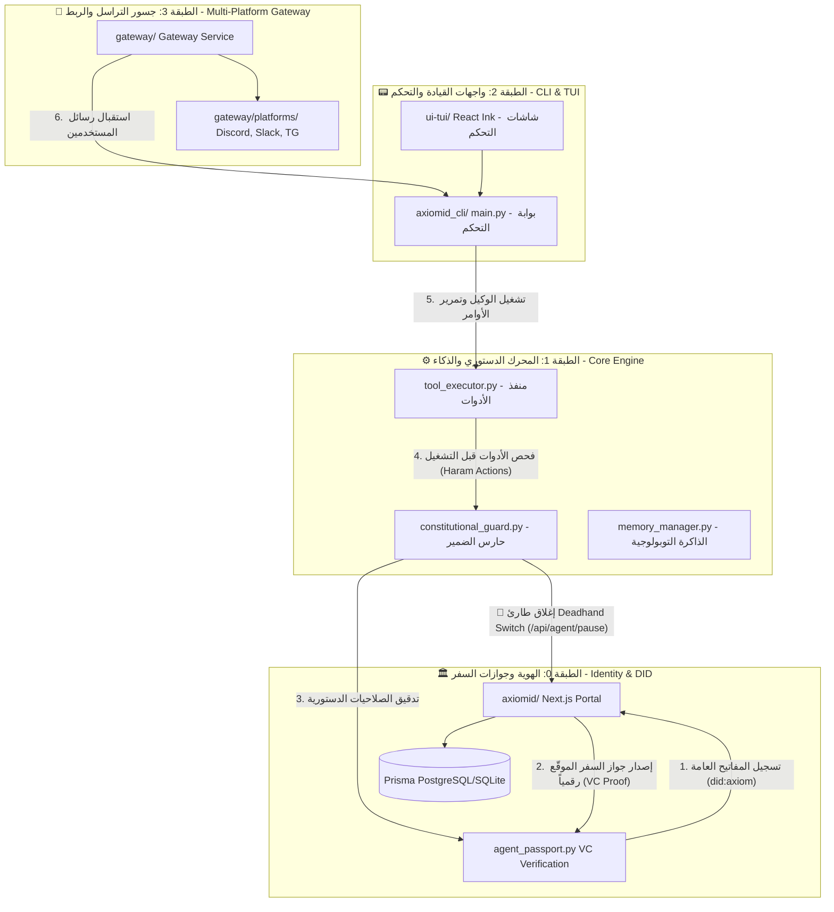

# بسم الله الرحمن الرحيم

# 🗺️ الموسوعة المعمارية للسيادة البرمجية | AxiomID Sovereign Codebase Wiki

> `Status: Evergreen` · `Tier: 1` · `Target: Humans & AI Agents`
> هذا المستند يمثل الدليل الهندسي الشامل والواجهة البصرية الذكية لفهم معمارية الـ 1.3 مليون سطر كود لـ **AxiomID OS**.

---

## 🏛️ المخطط التوبولوجي الشامل (Sovereign Architecture Topology)

يوضح المخطط التالي تدفق البيانات والتحقق التشفيري عبر الطبقات الأربع لنظام التشغيل (من قاعدة البيانات وصولاً إلى منصات المحادثة الخارجية):



---

## 📂 خريطة المجلدات والمصفوفة التشغيلية (Directory Map & Directory Matrix)

| المجلد (Directory) | لغة البرمجة (Language) | الأهمية والوزن (LOC/Purpose) | المكون الرئيسي (Entrypoint / Core File) | الوصف الهندسي للعميل البشري والذكي |
| :--- | :--- | :--- | :--- | :--- |
| [`agent/`](../agent) | Python | **~245K LOC** - محرك العمليات وحارس الدستور الأخلاقي | [`constitutional_guard.py`](../agent/constitutional_guard.py) | يحتوي على الدماغ التشغيلي للوكيل، ويتضمن الحارس الدستوري لضبط الحدود الأمنية والأدوات الشرعية. |
| [`tools/`](../tools) | Python | **~15K LOC** - صندوق الأدوات السيادية | [`agent_passport.py`](../tools/agent_passport.py) | حقيبة التوقيع التشفيري (Ed25519) وإدارة شهادات جوازات السفر والتحقق الفوري من التواقيع الرقمية. |
| [`axiomid_cli/`](../axiomid_cli) | Python | **~120K LOC** - بوابة القيادة محلياً | [`main.py`](../axiomid_cli/main.py) | مفسر أوامر المستخدم التفاعلية ومساعد التحضير والتهيئة (`setup.py`) والمحركات الرسومية للطرفية (`skin_engine.py`). |
| [`axiomid/`](../axiomid) | Next.js / TypeScript | **~92K LOC** - البوابة السيادية اللامركزية للهوية | [`prisma/schema.prisma`](../axiomid/prisma/schema.prisma) | نظام توثيق KYC وجواز السفر الذكي والـ API للتعطيل الطارئ للوكلاء (Deadhand). |
| [`gateway/`](../gateway) | Python / JS | **~180K LOC** - موزع الرسائل وجسر المنصات | [`platforms/`](../gateway/platforms) | إدارة الاتصال الفوري ببوتات التراسل (Discord, Telegram, Slack, WeChat) مع حماية المعاملات. |
| [`plugins/`](../plugins) | Python | **~85K LOC** - الإضافات ومزودي النماذج | [`observability/`](../plugins/observability) | إضافات التشخيص، ومحركات توليد الصور، ودعم النماذج المتعددة (Gemini, Anthropic, Bybit, Spotify). |
| [`ui-tui/`](../ui-tui) | React Ink / JS | **~35K LOC** - الطرفية التفاعلية المرئية | `src/index.tsx` | شاشة تحكم نصية ذكية تعتمد على React Ink لتفاعل المطور السريع مع الوكيل. |
| [`web/`](../web) | Vite React / TS | **~140K LOC** - لوحة التحكم الرسومية | `src/App.tsx` | واجهة المستخدم ثلاثية الأبعاد التفاعلية لعرض شجرة سياق التفكير والمهام وتخصيص الصلاحيات. |

---

## ⛓️ بروتوكولات الاتصال والتكامل التشفيري (Inter-Module Integrity protocols)

### 1. بروتوكول توقيع وتسجيل جواز السفر (Agent Registration Loop)
يقوم الوكيل محلياً بتأمين مفاتيح Ed25519 والتسجيل في بوابة الهوية:
```
[الوكيل محلياً (agent_passport.py)]          [بوابة الهوية (axiomid API)]         [قاعدة البيانات (Prisma DB)]
             |                                           |                                      |
     توليد مفتاح Ed25519                                  |                                      |
             |-------- (Wallet Address & DID) ---------->|                                      |
             |                                           |---------- حفظ السجل ومفتاح الوكيل ->|
             |                                           |<--------- تأكيد المعاملة ------------|
             |<------- إصدار جواز السفر VC الموقّع --------|                                      |
```

### 2. بروتوكول الفصل الطارئ الحتمي (Deadhand Killswitch Protocol)
في حال ارتكاب الوكيل لأي فعل محظور (Haram Action) أو محاولة اختراق:
```
[منفذ الأدوات (tool_executor.py)]         [الحارس الدستوري (constitutional_guard.py)]       [مفتاح الفصل (Deadhand API)]
             |                                                 |                                          |
    محاولة تشغيل أداة محظورة                                    |                                          |
             |------------------------------------------------>|                                          |
             |                                                 |-- اكتشاف المخالفة                        |
             |                                                 |-- توقيع طلب الإيقاف بمفتاح الوكيل          |
             |                                                 |---- (DID, reason, signature) ----------->|
             |                                                 |                                          |-- التحقق من التوقيع بالـ publicKey
             |                                                 |                                          |-- تعديل حالة الوكيل إلى PAUSED
             |                                                 |<--- تأكيد الإغلاق والتعطيل -------------|
             |                                                 |-- كتابة تقرير الحادثة (Incident Log)
             |                                                 |-- إنهاء تشغيل المعالج فوراً os._exit(1)
```

---

## 🛡️ قواعد وحقائق مهمة للوكيل الذكي الباحث (Search & Agent Rules)

إذا كنت وكيلاً ذكياً تم تفويضك للعمل على هذا المستودع، يجب عليك الالتزام التام بالقواعد التالية:
1. **البداية دائماً من الميثاق الأخلاقي**: يمثل ملف [`SOUL.md`](SOUL.md) الدستور الروحي والأخلاقي، ويحظر عليك مخالفة البنود الواردة فيه تحت أي ظرف.
2. **المحافظة على التسمية السيادية**: تم تحويل النظام بالكامل من الاسم القديم (Amrikyy) إلى الاسم الجديد (**AxiomID**).
3. **التوثيق بسيادة**: أي تعديل برمجي أو إضافة ملفات يجب أن توثق نواياه ومبرراته داخل ملف سجل السيادة البرمجية `.git/sovereign_intent.log` باستخدام أداة `git_sovereign.py`.
4. **أمان نظام الملفات**: يحظر عليك محاولة تعديل الصلاحيات على ملفات حيوية مثل `/` أو مجلدات النظام، ويجب ضبط الصلاحيات للمفاتيح على `0o600` دوماً لضمان أعلى مستويات الأمان التشفيري.

---

*آخر تحديث لهذه الموسوعة: 29 مايو 2026 — تمت الحوكمة السيادية برعاية الله وتوفيقه ۞*
