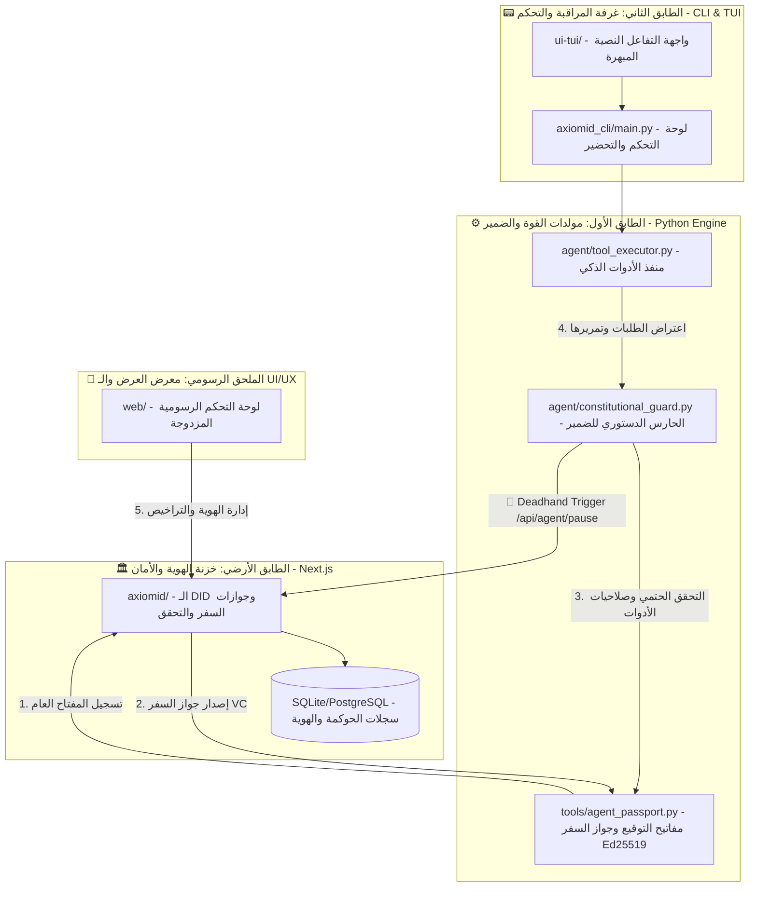

# 🏰 بيت الذكاء الاصطناعي | AxiomID AI Company Visual Map 🎨

مرحباً بك في **فيلا AxiomID للذكاء الاصطناعي**! هذا المستند يمثل الخارطة المعمارية البصرية الكاملة لكافة طوابق وغرف الفيلا البرمجية لتوضيح كيف تترابط وتعمل معاً لقيادة العصر الذكي.

---

## 🗺️ المخطط الهيكلي للفيلا (Sovereign AI House Blueprint)

---

## 🚪 جولة تفصيلية في غرف بيت الذكاء الاصطناعي 🚪

### 🔑 1. الطابق الأرضي: خزنة الهوية السيادية (Decentralized Identity Vault)
* **المكان**: `axiomid/`
* **المهمة**: إدارة تراخيص الوكلاء، إصدار جوازات السفر المشفرة (VCs)، والتحقق من المستخدمين البشر (Pi Network, EVM, Solana).
* **أهم الغرف**:
  - 🚪 `prisma/schema.prisma`: المخطط العام لقاعدة البيانات (سجلات الوكلاء، المفاتيح العامة `publicKey` وسلسلة الـ `did`).
  - 🚪 `src/app/api/agent/`: بوابة تسجيل المفاتيح العامة وإصدار جواز السفر VC الموقع رقمياً.
  - 🚪 `src/app/api/agent/pause/`: الـ API المخصصة للتعطيل الطارئ (Deadhand). تتحقق تشفيرياً من توقيع الوكيل قبل تغيير حالته لـ `PAUSED`.

### 🛡️ 2. الطابق الأول: غرفة الضمير والمولدات (The Conscience & Action Engine)
* **المكان**: `agent/` و `tools/`
* **المهمة**: تشغيل الوكيل وتأمين وتدقيق مدخلاته ومخرجاته ومنع السلوكيات غير المصرحة (Haram Actions).
* **أهم الغرف**:
  - 🚪 `agent/constitutional_guard.py`: الحارس الدستوري الذي يطبق السياسات الأمنية الحتمية ويطلق الـ Deadhand عند الانتهاك.
  - 🚪 `tools/agent_passport.py`: الأداة التشفيرية التي تولد مفاتيح الوكيل Ed25519 وتقوم بتوقيع طلبات الـ Deadhand تشفيرياً.
  - 🚪 `agent/tool_executor.py`: عصب تشغيل الأدوات بنوعيه المتوازي والمتتالي.

### 📟 3. الطابق الثاني: غرفة المراقبة والقيادة (The CLI & TUI Control Room)
* **المكان**: `axiomid_cli/` و `ui-tui/`
* **المهمة**: توفير لوحة قيادة نصية سريعة وسهلة الاستخدام لإعداد الوكلاء وتشغيل التفاعلات المباشرة.
* **أهم الغرف**:
  - 🚪 `axiomid_cli/main.py`: المدخل الرئيسي لسطر الأوامر واستقبال توجيهات التشغيل.
  - 🚪 `axiomid_cli/setup.py`: معالج التثبيت والتهيئة التفاعلية للمستخدم لضبط بيئة العمل الافتراضية.

### 🎨 4. الملحق الخارجي: معرض العروض الرسومية (The Creative UI/UX Hub)
* **المكان**: `web/`
* **المهمة**: تقديم لوحة تحكم رسومية مبهرة وتصاميم فنية مميزة لجوازات سفر الوكلاء وبطاقات الـ DID و KYC لتفوق أي مشروع آخر في عصر الوكلاء.
