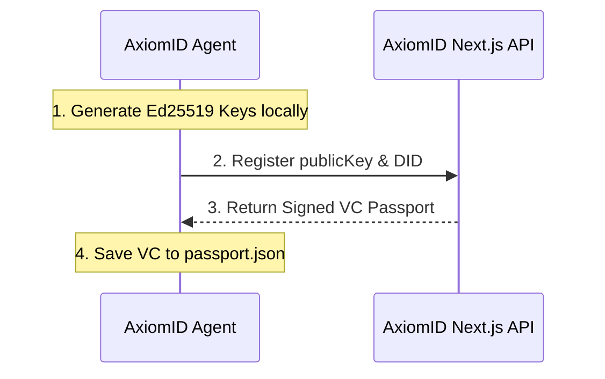

# Agent Passport & DID Framework

> Cryptographic design for agent identity and verifiable credentials.
> Updated: 2026-07-07

---

## Security Conscience

In traditional systems, an AI agent is just a software interface. In **AxiomID**, the agent is a **First-Class Identity Actor** with independent Ed25519 keys, a decentralized identity (DID), and a verifiable credential (VC) passport.



---

## Agent VC Passport Structure

```json
{
  "@context": ["https://www.w3.org/2018/credentials/v1"],
  "id": "urn:uuid:7c8b91a2-e289-4a3e-b165-27a3a9df8c8a",
  "type": ["VerifiableCredential", "AgentPassportCredential"],
  "issuer": "did:axiom:axiomid.app:root",
  "credentialSubject": {
    "id": "did:axiom:axiomid.app:ag_cl0923u",
    "owner": "demo:test_agent_user_123",
    "privilegeLevel": 1,
    "allowedToolsets": ["terminal", "file", "git_sovereign"],
    "spendLimits": {
      "dailyTokenLimit": 500000,
      "maxUsdcPerTx": 10
    }
  },
  "proof": {
    "type": "Ed25519Signature2020",
    "created": "2026-05-28T12:00:00Z",
    "verificationMethod": "did:axiom:axiomid.app:root#key-1",
    "proofPurpose": "assertionMethod",
    "proofValue": "z2M2bHJ...signature_hex"
  }
}
```

---

## Key Derivation

- **Algorithm:** Ed25519
- **Implementation:** `src/lib/did-document.ts`
- **Conversion:** `pemToMultibase()` — PEM → Multibase with Ed25519 multicodec prefix `0xed01`
- **Salt:** `SOVEREIGN_KEY_SALT` environment variable (HMAC key material)

---

## DID Format

```
did:axiom:axiomid.app:pi:{uid}
```

- `did` — DID prefix
- `axiom` — method name
- `axiomid.app` — network identifier
- `pi:{uid}` — Pi Network user ID

---

## Trust Delegation

- `DelegatedTrust` model stores trust relationships
- Users can delegate trust to agents
- Trust is transitive with configurable depth

---

## References

- `src/lib/did-document.ts` — DID resolution + key derivation
- `src/app/api/did-document/route.ts` — DID resolution endpoint
- `src/lib/trust.ts` — Trust score calculation
- `prisma/schema.prisma` — `DelegatedTrust`, `EphemeralDid` models
