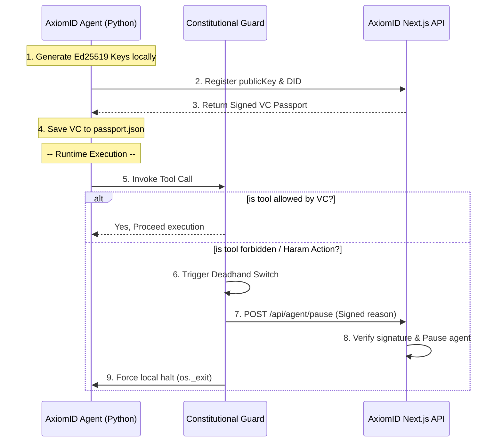

# بسم الله الرحمن الرحيم

---
tags:
  - axiomid/identity
  - security/deadhand
  - axiomid/passport
aliases:
  - Agent Passport & DID Framework
  - Deadhand Cryptographic Switch
created: 2026-05-28
status: active
tier: 1
---

# 🔑 إطار عمل جواز السفر والـ DID التشفيري | Agent Passport & DID Framework 🛡️

> [!info] الفكرة الجوهرية
> يوضح هذا المستند التصميم التشفيري والمعماري لبروتوكول الهوية الرقمية المستقلة وحلقة الأمان الطارئة (Deadhand Switch) للوكلاء.
> للمزيد من التفاصيل المعمارية، راجع [[codebase_map]] و [[HOME]].

---

## 🔒 المفهوم الأمني وجدار الحماية الحتمي (Security Conscience)

في الأنظمة التقليدية، يعتبر الوكيل AI مجرد واجهة برمجية. أما في **AxiomID & AxiomID**، فيُعامل الوكيل كـ **First-Class Identity Actor**؛ يمتلك مفاتيح Ed25519 مستقلة ووثيقة هوية لامركزية (DID) وشهادة صلاحيات قابلة للتحقق (Verifiable Credential - VC) تحكم نشاطه.



---

## 📄 بنية وثيقة جواز السفر (Agent VC Passport Structure)

> [!note] مواصفات الشهادة (VC Spec)
> يتم توليد شهادة جواز السفر بتنسيق Verifiable Credential قياسي وموقع رقمياً بمفتاح السيرفر الرئيسي:

```json
{
  "@context": [
    "https://www.w3.org/2018/credentials/v1"
  ],
  "id": "urn:uuid:7c8b91a2-e289-4a3e-b165-27a3a9df8c8a",
  "type": ["VerifiableCredential", "AgentPassportCredential"],
  "issuer": "did:axiom:axiomid.app:root",
  "credentialSubject": {
    "id": "did:axiom:axiomid.app:ag_cl0923u",
    "owner": "demo:test_agent_user_123",
    "privilegeLevel": 1,
    "allowedToolsets": ["terminal", "file", "git_sovereign"],
    "spendLimits": {
      "dailyTokenLimit": 500000,
      "maxUsdcPerTx": 10
    },
    "deadhandEndpoint": "http://localhost:3000/api/agent/pause"
  },
  "proof": {
    "type": "Ed25519Signature2020",
    "created": "2026-05-28T12:00:00Z",
    "verificationMethod": "did:axiom:axiomid.app:root#key-1",
    "proofPurpose": "assertionMethod",
    "proofValue": "z2M2bHJ...signature_hex"
  }
}
```

---

## ⚡ آلية التعطيل الطارئ (Deadhand Switch Execution)

> [!danger] بروتوكول الطوارئ
> عند حدوث أي انتهاك دستوري (Haram Action) أو تجاوز الصلاحيات الممنوحة:
> 1. تقوم أداة بايثون بتوقيع الرسالة (`reason`) باستخدام مفتاح الوكيل الخاص.
> 2. يتم إرسال طلب POST يحتوي على التوقيع الرقمي إلى رابط السيرفر.
> 3. يتحقق السيرفر تشفيرياً من صحة التوقيع عبر المفتاح العام المسجل للوكيل، وبذلك يتم تعطيل نشاط الوكيل في قاعدة البيانات المشتركة بشكل لحظي وآمن دون متطلبات الكوكيز.
> 4. ينتهي تشغيل الجلسة المحلية فوراً لضمان العزل والتحجيم الكامل للمخاطر.
