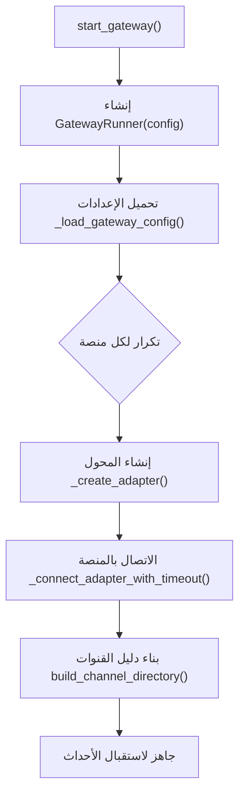
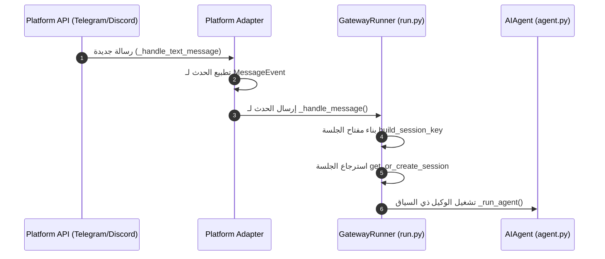

# بسم الله الرحمن الرحيم

# 🏛️ معمارية موجه الرسائل وتكامل المنصات لبوابة الذكاء الاصطناعي (Gateway Message Routing & Platform Integration Architecture) 🚀

---
Category: System Architecture
Tier: Tier 2 (Technical Specifications)
Last Updated: 2026-06-01
Status: Active
Nav: [[HOME]] | [[SOUL]] | [[topology]] | [[tools_skin_mcp_skills_map]] | [[tui_performance_profiling]] | [[gateway_architecture]]
---

> "وَجَعَلْنَا بَيْنَهُمْ وَبَيْنَ الْقُرَى الَّتِي بَارَكْنَا فِيهَا قُرًى ظَاهِرَةً وَقَدَّرْنَا فِيهَا السَّيْرَ" — سبأ: 18

ترسم هذه الوثيقة خريطة شاملة لمعمارية بوابة الرسائل (Gateway) متعددة المنصات في **AxiomID**، مغطية تدفقات التشغيل، استقبال الأحداث، المعالجة التدفّقية للردود (Streaming Responses)، وتكامل قنوات الاتصال والتحكم بدورة حياة الجلسات.

---

## 🏗️ 1. دورة حياة تشغيل البوابة (Gateway Startup Flow)

عند تشغيل البوابة عبر `gateway/run.py` بالدالة `start_gateway`:
1. **تحميل التكوين (Configuration Load)**:
   * إنشاء كائن المنسق `GatewayRunner` وقراءة ملف الإعدادات `config.yaml`.
2. **بناء المحولات التكيفية (Adapter Registry Factory)**:
   * تكرار التهيئة لكل منصة مفعلة (Telegram, Discord, Slack, etc.) عبر فئة محول المنصة (`_create_adapter`).
3. **تأسيس قنوات الاتصال والاتصال بالشبكة (Connect & Directory Build)**:
   * تشغيل الاتصال غير المتزامن لكل منصة (`_connect_adapter_with_timeout`) وبناء دليل القنوات الذكي (`build_channel_directory`).



---

## 📥 2. تدفق معالجة الرسائل الواردة (Inbound Message Ingestion)

عند استقبال رسالة نصية من منصة (مثل Telegram):
1. **تطبيع الحدث (Event Normalization)**:
   * تحويل الرسالة الخام إلى كائن موحد `MessageEvent` يحوي المعطيات الأساسية.
2. **توليد مفتاح الجلسة وحفظ السياق (Session Key Generation)**:
   * دمج المعرفات لبناء مفتاح فريد للجلسة `build_session_key` بالصيغة:
     $$\text{session\_key} = \text{platform} : \text{chat\_id} [ : \text{user\_id} ]$$
3. **تنفيذ عقل الوكيل (Agent Run Execution)**:
   * تمرير الحدث لمعالج البوابة الرئيسي `_handle_message_with_agent` وبدء حلقة تفكير الوكيل `_run_agent`.



---

## ⚡ 3. خط معالجة الرد التدفيقي (Streaming Response Pipeline)

أثناء قيام الوكيل بتوليد التوكينز (Tokens)، يتم دفع الرد تدريجياً لضمان استجابة لحظية متميزة للمستخدم:
* **تجميع الأجزاء (Delta Accumulation)**:
   * يلتقط معالج التوليف `GatewayStreamConsumer` الأجزاء المتدفقة (`on_delta`) ويقوم بوضعها في طابور غير متزامن (`_queue.put`).
* **تحديث الفقاعة الرسومية (Progressive Panel Edit)**:
   * تعمل دالة المستهلك `run()` بشكل مستقل لسحب البيانات وتجميع التوكينز وتحديث فقاعة المحادثة للمستند النهائي بشكل دوري (`edit_message`) لتقليل استهلاك الكوتا وتفادي الـ Rate Limiting.

```mermaid
graph LR
    subgraph Agent Thread (خيط معالجة الوكيل)
        delta[on_delta] --> queue_put[إدخال الطابور _queue.put]
    end
    subgraph Consumer Loop (حلقة معالجة العرض)
        queue_put --> read_queue[قراءة الطابور]
        read_queue --> accumulate[تجميع النص _accumulated]
        accumulate --> edit_msg[تحديث الرسالة edit_message]
    end
```

---

## 🗺️ 4. محرك توجيه التوصيل ودليل القنوات (Delivery Routing & Channel Directory)

لتوصيل الإشعارات والأوامر للمستلمين المطلوبين:
1. **تحليل الهدف (Target Parsing)**:
   * فحص نص التوصيل مثل `telegram:12345` أو اسم القناة مثل `#alerts` عبر `DeliveryTarget.parse`.
2. **البحث في دليل القنوات (Channel Directory Lookup)**:
   * مطابقة أسماء القنوات بالمعرفات الحقيقية (`resolve_channel_name`) بالاعتماد على محرك تصفية بـ (Prefix match) و (Exact ID match).
3. **التوصيل الفعلي عبر المحول (Adapter Send)**:
   * توجيه المحتوى المعالج لخدمة المنصة المستهدفة لإرسال الرسالة للمستخدم النهائي.

---

## ⚙️ 5. إدارة البوابة عبر سطر الأوامر (CLI Gateway Control)

يوفر موديول `axiomid_cli/gateway.py` التحكم الإداري ببيئة تشغيل البوابة:
* **اكتشاف العمليات (Process Discovery)**:
   * كشف المعرفات الرقمية (PIDs) للبوابات النشطة (`find_gateway_pids`) عبر فحص ملفات الحالة أو التحكم بالخدمات الخارجية (systemd/launchd).
* **إعادة التشغيل الذكي المفرغ (Drain-aware Restart)**:
   * إرسال إشارة الإيقاف التدريجي `SIGUSR1` لجعل البوابة تتوقف عن استقبال طلبات جديدة، وتنتظر إنهاء الجلسات النشطة، ثم تقوم بعملية Detached Restart آمنة.

---

## 🔒 6. حوكمة الجلسات وقوانين الإغلاق (Session Governance & Timeout Policy)

يدار سياق الجلسات وفق السياسات الحتمية التالية:
* **سياسة المهلة وعدم النشاط (Inactivity Timeout)**:
  * يحدد الوقت الأقصى للجلسة؛ في حال عدم وصول أي رسالة من المستخدم لفترة تتجاوز المهلة المحددة، يتم تصفير وحفظ الجلسة تلقائياً لتفادي تسرب الذاكرة.
* **الحفظ التثبيتي المقاوم للفشل (Atomic Session Persistence)**:
  * يتم تخزين الجلسات بصيغة JSON باستخدام تقنية الكتابة الذرية (`atomic_replace`) للملفات لمنع حدوث أي تلف في تكوين البيانات عند انقطاع الطاقة المفاجئ أو التحميل الزائد للمستودع.
