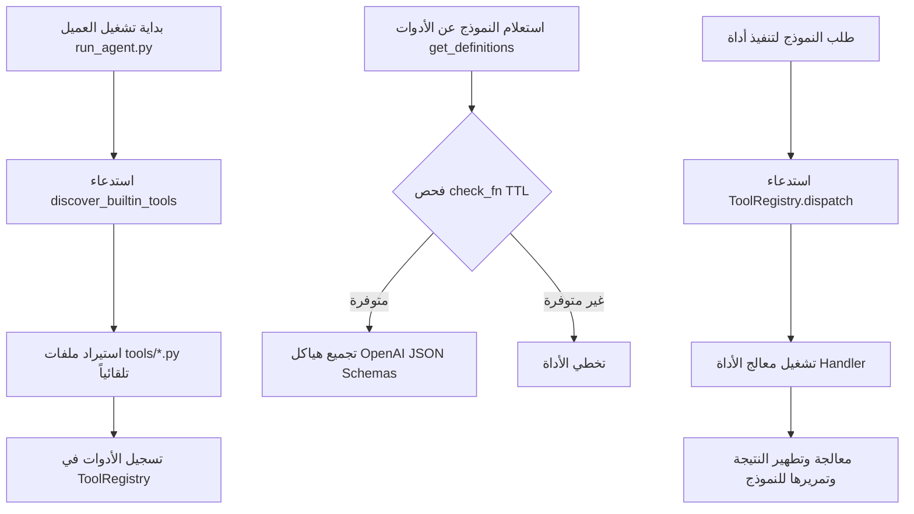

# ۞ خريطة معمارية الأدوات، السمات، الـ MCP، والمهارات في AxiomID

يرسم هذا المستند الفني المسارات التفصيلية، تدفق البيانات، وهياكل الشيفرة البرمجية (Line-level Mapping) لكل من أنظمة الأدوات الذكية، محرك المظهر الرسومي (Skin Engine)، بروتوكول موفر سياق الأدوات (Model Context Protocol)، ومحرك المهارات (Skills Hub) في عميل وبوابة **AxiomID**.

---

## 🛠️ 1. نظام الأدوات البرمجية وسجلها المركزي (AxiomID Tools & Registry)

يتم تنظيم وإدارة جميع الأدوات البرمجية للعميل عبر سجل مركزي موحد يضمن سلامة الاستدعاء وفحص البيئة والتحقق التلقائي.

### التدفق البرمجي ومواقع الشيفرة الأساسية:
- **نقطة تسجيل الأداة الصفرية (Module-Level Register)**:
  * تقوم ملفات الأدوات الفردية في مجلد `tools/` باستدعاء `registry.register()` عند استيراد الملف كـ Module.
  * المعرف الأساسي: `tools/registry.py:234` في الفئة `ToolRegistry.register`.
- **الاكتشاف التلقائي للأدوات المدمجة (Built-in Discovery)**:
  * يقوم الملف `tools/registry.py:57` بالدالة `discover_builtin_tools` بفحص مجلد `tools/*.py` واستيراد أي ملف يحتوي على استدعاء مباشر لـ `registry.register` في كتلته الأساسية.
- **موجه استدعاء الأدوات للنماذج (LLM Tool Schemas)**:
  * الدالة `ToolRegistry.get_definitions` في `tools/registry.py:337` تقوم بإنشاء وتصفية هياكل الأدوات (OpenAI Schemas) بناءً على فحص المتطلبات التشغيلية `check_fn` لكل أداة (مع التخزين المؤقت للنتيجة بـ TTL 30 ثانية لتسريع الأداء وتفادي تكرار عمليات الفحص الثقيلة).
- **التوجيه والتنفيذ الفعلي للأداة (Tool Dispatch)**:
  * الفئة `ToolRegistry.dispatch` في `tools/registry.py:390` تقوم باستدعاء معالج الأداة (Handler)، وجسر الدوال غير المتزامنة (Async Helpers) تلقائياً، والتقاط وتطهير الأخطاء البرمجية وإرجاعها كـ JSON معقم ومحمي للنموذج لمنع تسريب الرموز السرية أو التنسيقات غير المتوافقة.

---

## 🎨 2. محرك السمات والمظهر الرسومي للـ CLI (Skin/Theme Engine)

يتيح محرك السمات إمكانية تخصيص كامل للواجهة النصية التفاعلية للعميل عبر ملفات تعريف مظهر مرنة (YAML/Branding).

### البنية الفنية وخصائص الملف `axiomid_cli/skin_engine.py`:
- **مخطط المظهر التعريفي (Skin Schema)**:
  * يتم تعريف السمات في مجلد `~/.axiomid/skins/` أو كقوالب مدمجة (Built-in Presets) مثل المظهر الافتراضي أو مظهر `ares` الأسطوري.
  * **الألوان (Colors)**: مسار تحديد ألوان Rich Markup للحدود، العناوين، الأزرار، وحالة استهلاك السياق في شريط المهام (على سبيل المثال `response_border` في `skin_engine.py:32` و `status_bar_critical` في `skin_engine.py:40`).
  * **بروتوكول الانتظار والتفكير (Spinner Animation)**: تخصيص رموز متحركة أثناء استدعاء النماذج مثل `thinking_faces` في `skin_engine.py:56` والعبارات التعبيرية `thinking_verbs` في `skin_engine.py:59`.
  * **الهوية الرسومية للعلامة التجارية (Branding Customization)**: تغيير مسمى العميل التفاعلي مثل `agent_name` في `skin_engine.py:68` والرموز التعبيرية للأدوات `tool_emojis` في `skin_engine.py:79`.
- **دوال الوصول وتغيير المظهر**:
  * استرجاع السمة النشطة: `get_active_skin()` في `skin_engine.py:91`.
  * تفعيل مظهر جديد: `set_active_skin(name)` في `skin_engine.py:95` والذي يقوم بإعادة تحميل تكوين المظهر وحقنه في محرك العرض للـ TUI والـ CLI التفاعلي.

---

## 🔌 3. بروتوكول موفر سياق الأدوات ومحرك الـ MCP (Model Context Protocol Client)

يوفر معمارية متكاملة لربط عملاء الذكاء الاصطناعي بخوادم MCP خارجية للوصول المستقل للأدوات والبيانات.

### البنية الداخلية وتدفق الاتصال في `tools/mcp_tool.py` و `axiomid_cli/mcp_config.py`:
- **إدارة الاتصال والخلفية (Daemon Event Loop)**:
  * يطلق نظام الـ MCP خيط تشغيل مستقل (Daemon Thread) يدعى `_mcp_thread` في `tools/mcp_tool.py:64` يدير حلقة أحداث asyncio مخصصة لضمان عدم حظر خيط الواجهة النصية أو الاستدعاء الرئيسي.
- **محولات النقل والبروتوكول (Transports)**:
  * يدعم النقل عبر الاتصال القياسي المدخل/المخرج (Stdio Subprocess) لخدمات المطورين المحلية، والنقل عبر HTTP/StreamableHTTP أو بروتوكول أحداث الخادم (SSE Transports) للخدمات السحابية.
- **التسجيل الحركي والتحديث (Dynamic Tool Mapping)**:
  * عند نجاح الاتصال بأي خادم MCP سحابي أو محلي عبر `_connect_server` في `tools/mcp_tool.py:178` يقوم العميل بالتعرف على الأدوات المتاحة وإضافتها تلقائياً إلى سجل الأدوات الموحد `ToolRegistry` عبر `registry.register()`.
  * في حال إرسال خادم الـ MCP إشعاراً بتغيير قائمة الأدوات (`notifications/tools/list_changed`) يتم التحديث التلقائي الفوري عبر استدعاء `registry.deregister()` وإعادة رسم خريطة الأدوات لضمان توافقية البث.
- **إدارة دورة حياة الـ MCP عبر سطر الأوامر (`axiomid mcp`)**:
  * معرف التكوين والإضافة التفاعلية: `cmd_mcp_add` في `axiomid_cli/mcp_config.py:226`.
  * التوجيه والفحص والربط: `cmd_mcp_test` في `axiomid_cli/mcp_config.py:523`.
  * الحذف وتطهير مفاتيح المصادقة: `cmd_mcp_remove` في `axiomid_cli/mcp_config.py:422`.

---

## 🎓 4. مستودع ومحرك المهارات (Skills Hub & Lifecycle)

تُمثل المهارات (Skills) حزم توجيهية مستقلة بصيغة Markdown مصممة خصيصاً لتلقين العميل ممارسات وقواعد معينة لمهام متخصصة.

### البنية وتدفق التثبيت البرمجي في `axiomid_cli/skills_hub.py` و `skills_config.py`:
- **بوابة مستودع المهارات التفاعلية (Skills Hub CLI)**:
  * يمثل الملف `axiomid_cli/skills_hub.py` الموزع الرئيسي لعمليات المهارات عبر شات العميل النصي أو سطر الأوامر.
- **البحث المتكامل والتحقق (Unified Search & Inspect)**:
  * الدالة `do_search` في `skills_hub.py:246` تبحث في المستودعات الرسمية ومصادر المجتمع المتعددة.
  * الدالة `do_inspect` في `skills_hub.py:640` تمكن المستخدم من فحص ومعاينة حزمة المهارة وملف `SKILL.md` قبل التثبيت الفعلي.
- **بوابة الفحص والتأمين الأمني (Skills Quarantine & Scan)**:
  * عند البدء في التثبيت عبر `do_install` في `skills_hub.py:414` يتم نقل الملفات مؤقتاً إلى مجلد الحجر الصحي (Quarantine Folder) عبر الدالة `quarantine_bundle`.
  * يتم استدعاء محرك الفحص الأمني `scan_skill` في `tools/skills_guard.py` لفحص الشيفرة بحثاً عن ملفات مشبوهة أو تعليمات برمجية ضارة.
  * يتم تطبيق سياسة التثبيت المعتمدة وتوثيق الحدث في سجل التدقيق الأمني `append_audit_log` قبل تمرير المهارة وتفعيلها في مجلد المهارات المحلي.
- **إدارة التمكين والتعطيل (Skills Configuration)**:
  * يتيح الملف `axiomid_cli/skills_config.py` تمكين وتعطيل المهارات كلياً أو تخصيصها لكل بوابة ومنصة مراسلة بشكل مستقل (عبر المفتاح `platform_disabled` في `skills_config.py:10`).

---

### 🗺️ خطة المزامنة القادمة لمستندات الذاكرة

- [x] رسم خريطة الأدوات وسجل الأدوات الفعلي
- [x] تحديد آلية عمل ومكونات محرك السمات الرسومية
- [x] توثيق طبقة النقل وبنية الاتصال لبروتوكول MCP
- [x] تفصيل معمارية مستودع المهارات ودورة الحجر والفحص الأمني
