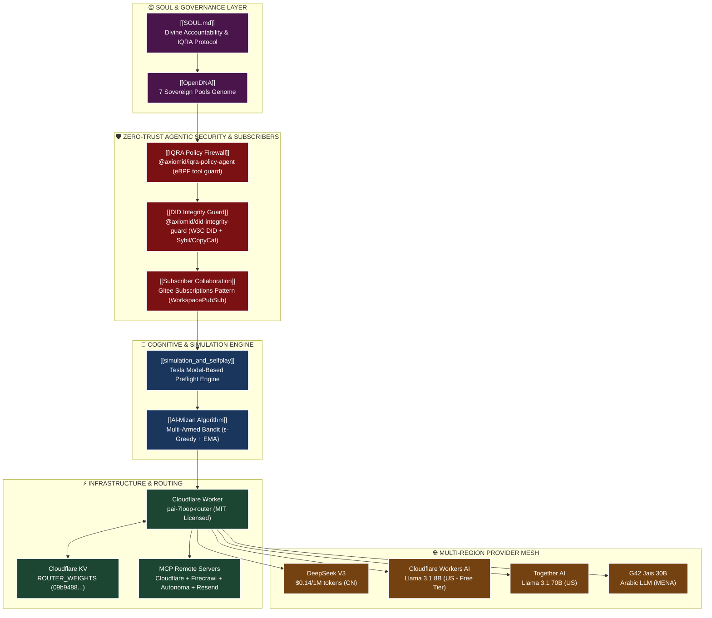

# 🗺️ AxiomID Sovereign System Topology Map
## Obsidian Visual Knowledge Graph & Architecture Node Map

---

Category: System Topology & Architecture
Version: 1.0.0
Last Updated: 2026-07-22
Nav: [[HOME]] | [[SOUL]] | [[PROJECT_STATUS]] | [[simulation_and_selfplay]] | [[OpenDNA]]

---

## 🌌 Node Graph Visual Map

---

## 🏛️ Layer Topology Breakdown

### Layer 1: Governance & Identity (`SOUL_LAYER`)
- **[[SOUL.md]]**: Ethical boundary verification filter (Muraqabah, Sab'iyyah, Tawbah).
- **[[OpenDNA.md]]**: Sovereign genome defining 7 pools: `IDENTITY`, `GOVERNANCE`, `ETHICS`, `CAPABILITIES`, `REASONING`, `DATA_MEMORY`, `COMPLIANCE`.

### Layer 2: Zero-Trust Security & Workspace Collaboration (`ZERO_TRUST_SECURITY`)
- **IQRA Policy Agent (`@axiomid/iqra-policy-agent`):** Sub-millisecond tool execution firewall modeled after AWS Network Policy eBPF daemons.
- **DID Integrity Guard (`@axiomid/did-integrity-guard`):** W3C DID cryptographic verification, Sybil scammer bot detector (velocity/fan-out anomalies), and Gitee CopyCat code clone scanner.
- **Subscriber Collaboration System:** Decoupled Pub/Sub event router modeled after Gitee Subscribers API (`GET /v5/repos/{owner}/{repo}/subscribers`).

### Layer 3: Cognitive Simulation & Decision (`COGNITIVE_ENGINE`)
- **[[simulation_and_selfplay.md]]**: Deterministic preflight simulation (`Incubation` → `Construction` → `Virtual Testing` → `Refinement` → `Materialization`).
- **Al-Mizan Router:** Multi-Armed Bandit with $\epsilon$-greedy exploration ($\epsilon=0.10 \to 0.01$) and Exponential Moving Average (EMA, $\alpha=0.10$) weight updates.

### Layer 4: Infrastructure & Edge Execution (`DEPLOYMENT_INFRA`)
- **Cloudflare Worker:** `workers/pai-7loop-router/src/index.ts` deployed on Cloudflare Workers edge (MIT Open-Source).
- **Cloudflare KV:** Bound namespace `ROUTER_WEIGHTS` (`09b948855402477aa2d990f3058925b6`) persisting live provider score maps.
- **MCP Servers:** Remote MCP servers configured in `.mcp.json` (Cloudflare, Firecrawl keyless, Autonoma, Resend email MCP).

### Layer 5: Multi-Region LLM Mesh (`PROVIDER_MESH`)
- **DeepSeek V3 (CN):** $0.14/1M input tokens — Primary cost-optimized code & reasoning engine.
- **Cloudflare Workers AI (US):** Llama 3.1 8B — 100k free requests/day.
- **Together AI (US):** Llama 3.1 70B Turbo — High capacity fallback.
- **G42 Jais 30B (MENA):** Specialized Arabic regional model.

---

## 🔗 Wiki Node Connections
- Node: [[HOME]]
- Node: [[SOUL]]
- Node: [[PROJECT_STATUS]]
- Node: [[simulation_and_selfplay]]
- Node: [[repo_dna]]
