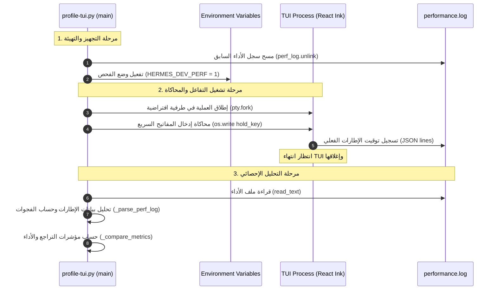

# بسم الله الرحمن الرحيم

# 📊 نظام فحص وضبط أداء الواجهة النصية (TUI Performance Profiling System) 🚀

---
Category: Performance & Testing
Tier: Tier 2 (Technical Specifications)
Last Updated: 2026-06-01
Status: Active
Nav: [[HOME]] | [[SOUL]] | [[topology]] | [[tools_skin_mcp_skills_map]] | [[tui_performance_profiling]]
---

> "إِنَّا كُلَّ شَيْءٍ خَلَقْنَاهُ بِقَدَرٍ" — القمر: 49

تتبع أداة قياس وضبط أداء الواجهة الرسومية النصية (React Ink TUI) وتحليل الفجوات الزمنية بين الإطارات (Frame Gap Analysis) ورصد أي تراجع في الأداء (Performance Regressions). يتيح هذا النظام لـ **AxiomID** استكشاف كفاءة المعالجة الرسومية ومعدل تحديث الشاشة وتفادي اختناقات الواجهة.

---

## 🌀 المخطط الانسيابي لقياس الأداء (Profiler Execution Flow)

يمر تشغيل فاحص الأداء بأربع مراحل متتالية:



---

## 🛠️ خط الأنابيب لتحليل سجل الأداء (Performance Log Analysis Pipeline)

تتم عملية القياس الإحصائي في الدالة `_parse_perf_log` وعملية التلخيص في الدالة `_summarize(frames)` عبر الخطوات التالية:

1. **قراءة السجلات وإطارات الإدخال**:
   * فحص الأسطر وقراءة بيانات JSON لكل إطار رسومي مسجل (`json.loads(line)`).
2. **حساب الفجوات الزمنية (Interframe Gaps)**:
   * حساب الفرق الزمني بالملي ثانية بين كل إطارين متتاليين:
     $$\text{gap} = \text{timestamp}[i] - \text{timestamp}[i-1]$$
     المعرف البرمجي: `profile-tui.py:306`
3. **تحديد مقاييس جودة العرض الرسومي**:
   * **مؤشر الوسيط (gap_p50_ms)**: يمثل وسيط الفجوة الزمنية للحالة العادية.
   * **مؤشر الكمية p99 (gap_p99_ms)**: يمثل فجوة الاستجابة القصوى (Tail Latency) والتي تعبر عن ذروة البطء أو التعليق.
   * **الإطارات الناعمة (gaps_under_16ms)**: لحساب عدد الإطارات التي تم عرضها بمعدل تحديث يقل عن 16 ملي ثانية (ما يعادل 60 إطاراً في الثانية).
   * **الإطارات البطيئة (gaps_over_200ms)**: لحساب الإطارات التالفة أو المعطلة التي تتجاوز فجوتها 200 ملي ثانية (تعليق الواجهة TUI).

---

## ⚠ كاشف التراجع في الأداء (Performance Regression Detection System)

لمنع حدوث أي انهيار في سلاسة العرض أثناء كتابة الأكواد، يقوم الفاحص بمقارنة نتائج التشغيل الفعلي ببيانات الأساس (Baseline Data) عبر الدالة `_compare_metrics(baseline, current)`:

```
                          ┌────────────────────────┐
                          │    حساب الفرق الفعلي   │
                          │      (d = a - b)       │
                          └───────────┬────────────┘
                                      │
                                      ▼
                          ┌────────────────────────┐
                          │  تحديد اتجاه التحسن    │
                          └─────┬────────────┬─────┘
                                │            │
            Lower is Better     │            │     Higher is Better
         (p99, gaps_over, etc.) │            │    (fps_, gaps_under)
                                ▼            ▼
                        ┌──────────┐      ┌──────────┐
                d < 0   │  ✓ تحسن  │      │  ✓ تحسن  │   d > 0
                        └──────────┘      └──────────┘
                        ┌──────────┐      ┌──────────┐
                d > 0   │  ⚠ تراجع │      │  ⚠ تراجع │   d < 0
                        └──────────┘      └──────────┘
```

* **مؤشرات يفضل انخفاضها (Lower is Better)**:
  * تشمل كميات التأخير القصوى (`p99`), الحد الأقصى للتأخير (`_max`), إجمالي وقت الانتظار (`_total`), عدد الإطارات البطيئة (`gaps_over`), والضغط الخلفي للبيانات (`backpressure`).
* **مؤشرات يفضل ارتفاعها (Higher is Better)**:
  * تشمل معدل الإطارات بالثانية (`fps_`), وعدد الإطارات فائقة النعومة (`gaps_under`).
* **شعار المقارنة التلقائي**:
  * يرمز لعلامة التحسن أو الثبات بـ `✓` وعلامة التراجع أو البطء بـ `⚠`.
