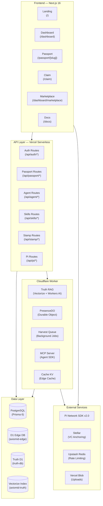

<div align="center">
  <picture>
    <source media="(prefers-color-scheme: dark)" srcset="./public/axiomid-banner.jpg">
    
  </picture>
</div>

<h1 align="center">
  AxiomID gives humans sovereign control over their AI agents<br/>
  using portable DIDs and Pi Network.
</h1>

<p align="center">
  <em>The Human Authorization Protocol for AI Agents</em>
</p>

<p align="center">
  <a href="https://axiomid.app"><b>🌐 Live App</b></a> ·
  <a href="https://axiomid.app/passport/demo"><b>🛂 Demo Passport</b></a> ·
  <a href="https://axiomid.app/leaderboard"><b>📊 Leaderboard</b></a> ·
  <a href="https://github.com/Moeabdelaziz007/AxiomID"><b>⭐ Star on GitHub</b></a>
</p>

<p align="center">
  <a href="https://github.com/Moeabdelaziz007/AxiomID/actions/workflows/ci.yml"></a>
  <a href="https://github.com/Moeabdelaziz007/AxiomID/releases"></a>
  <a href="https://github.com/Moeabdelaziz007/AxiomID/blob/main/LICENSE"></a>
  
  
  
  
  <a href="https://github.com/Moeabdelaziz007/AxiomID/blob/main/CONTRIBUTING.md"></a>
  
  <a href="https://www.npmjs.com/package/@axiomid/sdk"></a>
  <a href="https://www.npmjs.com/package/@axiomid/crypto"></a>
  <a href="https://axiomid.app/status"></a>
</p>

---

> **⚠️ Beta Notice:** AxiomID is in active development. Features work in Pi Browser and modern browsers. Demo accounts are used during the closed beta phase. [Live status →](https://axiomid.app/status)

---

**Try it live:** [`axiomid.app/passport/demo`](https://axiomid.app/passport/demo) → See a real Sovereign passport with Trust Score, badges, and KYA verification. No wallet needed.

---

## Architecture



---

## Releases & Packages

| Release | Version | Date | Description |
|:---|:---:|:---:|:---|
| **Latest** | **v0.1.1** | 2026-06-27 | Issue infrastructure, Arabic i18n, performance fixes |
| Previous | v0.1.0 | 2026-06-25 | Core protocol — DID, Trust Engine, Passports, Marketplace |

| Package | Version | License | Published |
|:---|:---:|:---:|:---:|
| [`@axiomid/sdk`](https://www.npmjs.com/package/@axiomid/sdk) | 0.1.0 | MIT | ✅ |
| [`@axiomid/crypto`](https://www.npmjs.com/package/@axiomid/crypto) | 0.1.0 | MIT | ✅ |

---

## Trust Score at a Glance

Every identity on AxiomID has a **Trust Score** — an algorithmic reputation built from verified stamps and experience points (XP). Computed in [`src/lib/trust.ts`](./src/lib/trust.ts).

### Trust Calculation Formulas

AxiomID uses a dual-calculation mode based on available data:

1. **Standard Mode (Fallback) — XP + Stamps:**
   ```
   xpScore = min(100, max(0, floor(xp / 10)))
   stampScore = round((claimedStamps / 10) * 100)
   trustScore = xpScore × 0.7 + stampScore × 0.3
   ```
   *(Clamped to 0–100)*

2. **Advanced Mode — with Tenure & Semantic Trust:**
   ```
   trustScore = xpScore × 0.5 + stampScore × 0.2 + tenureScore × 0.1 + semanticTrust × 0.2
   ```
   - **Tenure:** 2% per day, capped at 100% (50 days)
   - **Semantic Trust:** Dynamically computed from agent reputation and peer vouches (0–100)

### API Passport Example

**Live endpoint:** [`GET /api/passport/demo`](https://axiomid.app/api/passport/demo) — returns the complete passport JSON:

```json
{
  "username": "AxiomID Agent",
  "walletAddress": "GD5...3H",
  "stellarAddress": "GB6...4K",
  "did": "did:axiom:pi:user123",
  "tier": "Sovereign",
  "xp": 1200,
  "trustScore": 94,
  "kyaStatus": "VERIFIED",
  "kycStatus": "VERIFIED",
  "stamps": [
    { "type": "KYA", "provider": "pi_network" },
    { "type": "WALLET_AGE", "provider": "stellar" }
  ],
  "issuedDate": "2026-06-25T12:00:00.000Z",
  "agentName": "SovereignNode1",
  "agentStatus": "ACTIVE",
  "agentPublicKey": "MGP..."
}
```

---

## Sovereign Passport

When a user claims their identity, they get a **Sovereign Passport**:

| Field | Value |
|:---|:---|
| **DID** | `did:axiom:axiomid.app:pi:{uid}` |
| **Tier** | Visitor → Citizen → Validator → **Sovereign** |
| **Trust Score** | 0–100 |
| **Stamps** | KYA, Social, Pi Wallet, Agent Delegation |
| **Attestations** | Peer-signed reputation vouches |
| **VC Anchoring** | SHA-256 hashes committed to Stellar testnet/mainnet |

**Claim yours in 3 steps:**

<div align="center">

| Step | Action | Time |
|:---:|:---|:---:|
| **1** | Connect Pi Wallet | 10s |
| **2** | Complete KYC/KYA Verification | 30s |
| **3** | Deploy Your Agent | Instant |

</div>

Open [`axiomid.app/claim`](https://axiomid.app/claim) in **Pi Browser** or any modern browser.

---

## What AxiomID Does

| Layer | What It Does |
|:---|:---|
| **DID** | `did:axiom` — W3C-compliant, self-sovereign identity per user |
| **Verifiable Credentials** | Ed25519-signed stamps (social, KYA, KYC). Each stamp is a VC anchored on Stellar. |
| **Trust Engine** | Algorithmic trust score = `XP (50–70%) + stamps (20–30%) + tenure + semantic trust` |
| **Agent Passports** | Public identity cards with verification badges, trust scores, and attestation history |
| **Skills Marketplace** | Install capabilities for agents, Pi-powered payments, versioning & moderation |
| **Truth RAG** | AI-powered Q&A over 6236 Arabic/English verses via Vectorize + Workers AI (Llama 3.1 8B) |
| **Soul System** | Six-gate ethical framework — Muraqabah, Tawbah, TrustChain, Tasbih, Sab'iyyah, Barakah |
| **Pi Native Features** | Native share dialog, KYC consent, and payment flows via Pi Browser SDK (v2.0) |
| **VC Anchoring** | SHA-256 hashes committed to Stellar for tamper-proof on-chain verification |
| **PWA** | Offline support, service worker caching, installable as stand-alone app |

### The Soul System (6 Ethical Gates)

AI Agent execution inside AxiomID is guarded by the **Soul System** — six ethical gates defined in [`src/lib/soul-principles.ts`](./src/lib/soul-principles.ts) and [`AGENTS.md`](./AGENTS.md):

| # | Gate | Arabic | Principle |
|:---:|:---|:---|:---|
| 1 | **Vigilance** (Muraqabah) | اليقظة | Divine Awareness — every mutating action is observed and recorded |
| 2 | **Correction** (Tawbah) | التصحيح | Self-Correction — admit bugs, fix root causes, add guards |
| 3 | **Ledger** (TrustChain) | السجل | Append-only logs, hash chains, tamper evidence |
| 4 | **Triad** (Tasbih) | الثلاثية | Three retry cycles — exponential backoff, not infinite |
| 5 | **Septet** (Sab'iyyah) | السبعية | Cycle Learning — every 7 cycles, synthesize holistically |
| 6 | **Compounding** (Barakah) | التراكم | Milestone Multiplication — consistency compounds at scale |

### Pi Native Features

AxiomID deeply integrates Pi Network SDK v2.0 native features (see [`src/lib/pi-native-features.ts`](./src/lib/pi-native-features.ts)):

- **Share Dialog:** `Pi.nativeFeature.openShareDialog()` — share passports natively in Pi Browser
- **KYC Consent:** `Pi.nativeFeature.openConsentDialog()` — native consent before verification
- **Payments:** `Pi.createPayment()` — marketplace purchases with Pi cryptocurrency
- **Fallback chain:** Pi Browser → Web API (`navigator.share`) → clipboard copy

### Dynamic Sandbox Mode

AxiomID automatically determines sandbox mode via a fallback cascade (implemented in [`src/lib/pi-sandbox.ts`](./src/lib/pi-sandbox.ts)):

1. **Environment Variables:** `NEXT_PUBLIC_SANDBOX_DEV_TOKEN` (development only)
2. **Hostname Check:** Dynamic checks for `localhost`, LAN networks, or staging domains
3. **Iframe Referrer:** If the frame parent is `sandbox.minepi.com`
4. **Query Parameter:** `?sandbox=true` in the URL

*In production on custom domains (e.g. `axiomid.app`), sandbox mode is strictly disabled.*

---

## Packages

### `@axiomid/sdk`

```bash
npm install @axiomid/sdk
```

```typescript
import { AxiomSDK } from "@axiomid/sdk";

const sdk = new AxiomSDK({ network: "mainnet" });

const trust = await sdk.getTrustScore("did:axiom:pi:user123");
// { did: "did:axiom:pi:user123", score: 94, tier: "Sovereign" }

const passport = await sdk.verifyPassport("did:axiom:pi:user123");
// Complete Passport object (username, did, stamps, trustScore, etc.)
```

### `@axiomid/crypto`

```bash
npm install @axiomid/crypto
```

```typescript
import { deriveKeypair, signPayload, verifySignature } from "@axiomid/crypto";

const keypair = deriveKeypair("seed");
const signature = signPayload(keypair.privateKey, "message");
const valid = verifySignature(keypair.publicKey, "message", signature);
```

*Both packages are MIT-licensed for community use. See [`packages/sdk/`](./packages/sdk) and [`packages/crypto/`](./packages/crypto).*

---

## Quick Start

```bash
git clone https://github.com/Moeabdelaziz007/AxiomID.git
cd AxiomID
npm install
cp .env.example .env.local
# Fill in: DATABASE_URL, PI_API_KEY, SOVEREIGN_KEY_SALT, auth secrets
npx prisma migrate deploy && npx prisma generate
npm run dev
```

Open [http://localhost:3000](http://localhost:3000).

### Backend (Cloudflare Worker)

```bash
cd backend && npm install
npx wrangler d1 execute axiomid-edge --remote --file=./migrations/0001_init.sql
npx wrangler d1 execute truth-db --remote --file=./migrations/0002_truth.sql
echo "token" | npx wrangler secret put SHARED_SECRET_TOKEN_VERCEL_CF
npx wrangler deploy
```

### Local HTTPS for Pi Browser

Pi SDK requires HTTPS. Use `portless` for local HTTPS:

```bash
npm install -g portless
portless axiomid next dev
# → https://axiomid.localhost
```

---

## Pages

| Route | Description |
|:---|:---|
| `/` | Landing — live network stats, trust tiers, animated demo |
| `/about` | About AxiomID |
| `/claim` | 3-step onboarding (Connect → Verify → Deploy) |
| `/dashboard` | Authenticated dashboard — stats, agent controls, activity |
| `/dashboard/marketplace` | Skills Marketplace with Pi payments |
| `/dashboard/sandbox` | Sandbox for testing agent skills |
| `/dashboard/settings` | User settings (profile, accounts, ledger) |
| `/docs` | Full docs — stamps, SDK, API reference |
| `/explorer` | Browse all registered agents |
| `/leaderboard` | Top 50 users ranked by XP |
| `/offline` | Offline fallback (PWA) |
| `/onboarding` | Onboarding wizard (bilingual) |
| `/passport/[slug]` | Public passport viewer with OG metadata |
| `/privacy` | Privacy policy |
| `/signin/callback` | OAuth sign-in callback |
| `/status` | Live service health (DB, Stellar, Pi, Workers AI) |
| `/terms` | Terms of service |

---

## API Routes

| Group | Route | Description |
|:---|:---|:---|
| **Auth** | `POST /api/auth/connect` | Connect Pi account |
| | `POST /api/auth/pi` | Pi SDK authentication |
| | `GET /api/auth/state` | OAuth state verification |
| | `POST /api/auth/logout` | Logout |
| **Agent** | `GET /api/agent` | Get agent status |
| | `POST /api/agent/activate` | Activate agent |
| | `POST /api/agent/pause` | Pause agent |
| | `POST /api/agent/identity` | Set agent identity |
| | `POST /api/agent/identity/claim` | Claim agent identity |
| | `GET /api/agent/manifest` | Agent manifest |
| | `POST /api/agent/sign` | Sign with agent key |
| | `GET /api/agent/main` | Agent main endpoint |
| | `POST /api/agents/harvest` | Harvest agent data |
| **Passport** | `GET /api/passport/[slug]` | Get passport |
| | `POST /api/passport/[slug]/publish` | Publish passport |
| | `POST /api/passport/[slug]/verify` | Verify passport |
| **Skills** | `GET /api/skills` | List all skills |
| | `GET /api/skills/[slug]` | Get skill details |
| | `POST /api/skills/[slug]/install` | Install skill |
| | `POST /api/skills/[slug]/pay` | Pay for skill |
| | `POST /api/skills/[slug]/purchase` | Purchase skill |
| | `GET /api/skills/[slug]/review` | Get skill reviews |
| | `GET /api/skills/[slug]/stats` | Skill statistics |
| | `GET /api/skills/[slug]/tags` | Skill tags |
| | `GET /api/skills/[slug]/versions` | Skill versions |
| | `POST /api/skills/[slug]/execute` | Execute skill (sandboxed) |
| | `GET /api/skills/tags` | All skill tags |
| | `POST /api/admin/skills` | Admin: create skill |
| | `PUT /api/admin/skills/[id]` | Admin: update skill |
| **Pi** | `POST /api/pi/kya/claim` | Claim KYA |
| | `POST /api/pi/kya/verify` | Verify KYA status |
| | `POST /api/pi/payment/approve` | Approve Pi payment |
| | `POST /api/pi/payment/complete` | Complete Pi payment |
| | `POST /api/pi/ads/verify` | Verify Pi ads |
| **Stamps** | `GET /api/stamp` | List stamps |
| | `POST /api/stamp/claim` | Claim a stamp |
| **Social** | `POST /api/social/disconnect` | Disconnect social account |
| **Stellar** | `POST /api/stellar/anchor` | Anchor VC on Stellar |
| **Sync** | `POST /api/sync` | Sync data (cron) |
| **Sandbox** | `GET /api/sandbox/dev-token` | Dev token status |
| | `POST /api/sandbox/execute` | Execute sandboxed code |
| **System** | `GET /api/health` | Health check |
| | `GET /api/status` | Service status |
| | `GET /api/did-document` | DID document |
| | `GET /api/credential-status` | Credential status |
| | `GET /api/explorer` | Explorer data |
| | `GET /api/leaderboard` | Leaderboard |
| | `GET /api/user/status` | User status |
| | `GET /api/daily-review` | Daily review |
| | `GET /api/presence/heartbeat` | Presence heartbeat |
| | `POST /api/upload/presign` | Presigned upload URL |
| | `POST /api/vault/stake` | Vault staking |
| | `POST /api/telegram` | Telegram webhook |
| | `POST /api/emulate/[...path]` | Emulate routes |
| | `POST /api/agent-main` | Agent main fallback |

---

## Trust Tiers

| Tier | XP Required | Access |
|:---|:---:|:---|
| **Visitor** | 0 | Limited read-only |
| **Citizen** | 100 | Social stamps, basic agent access |
| **Validator** | 500 | Agent delegation, marketplace install |
| **Sovereign** | 1000 | Full trust, vault staking, vouching power |

---

## Backend Architecture (Cloudflare Worker)

The backend at [`backend/`](./backend) runs on Cloudflare Workers and includes:

| Component | Technology | Purpose |
|:---|:---|:---|
| **Router** | itty-router | Request routing |
| **Durable Objects** | `PresenceDO` | Real-time presence coordination |
| **Queue** | `harvest-queue` | Background data harvesting |
| **KV** | `CACHE_KV` | Edge caching layer |
| **D1 Edge DB** | `axiomid-edge` | Edge-relational data |
| **Truth D1** | `truth-db` | 6236 verses for RAG |
| **Vectorize** | `axiomid-truth` | 768-dim embedding index (bge-base-en-v1.5) |
| **Workers AI** | Llama 3.1 8B | Truth Q&A generation |
| **MCP** | Model Context Protocol | Agent SDK integration |

---

## Tech Stack

| Layer | Technology |
|:---|:---|
| **Frontend** | Next.js 16 · React 19 · Framer Motion 12 · Tailwind 4 · Lucide Icons |
| **Backend (Vercel)** | Serverless API Routes · Prisma 6 ORM · Zod validation |
| **Backend (Cloudflare)** | Workers · Durable Objects · D1 · Vectorize · Workers AI · Queues · KV |
| **Database** | PostgreSQL (Ghost.build/Supabase) · D1 Edge (axiomid-edge) · Truth D1 (truth-db) |
| **AI** | Workers AI — Llama 3.1 8B · BGE-base-en-v1.5 (768-dim) for embeddings |
| **Auth** | Pi Network SDK v2.0 · Ed25519 sovereign keys · W3C DID |
| **Identity** | `did:axiom` DIDs · Verifiable Credentials · Stellar anchoring |
| **Payments** | Pi Network · Stellar (VC anchoring) |
| **Storage** | Cloudflare KV · Vercel Blob · Upstash Redis |
| **Monitoring** | Sentry · Vercel Analytics · Vercel Speed Insights |
| **Packages** | `@axiomid/sdk` (v0.1.0) · `@axiomid/crypto` (v0.1.0) — both MIT |
| **CI/CD** | GitHub Actions → Vercel · 3085 tests, 153 suites |
| **PWA** | Service Worker (network-first API, stale-while-revalidate assets) |

---

## Testing

```bash
npm test           # 3085 tests, 153 suites
npm run lint       # 0 errors, 0 warnings
npx tsc --noEmit   # type check
npx knip           # dead code detection
npm run a11y       # accessibility (pa11y-ci)
```

---

## Environment Variables

Copy [`.env.example`](./.env.example) to `.env.local` and fill in:

| Category | Variables |
|:---|:---|
| **Database** | `DATABASE_URL`, `NEXT_PUBLIC_SUPABASE_URL`, `NEXT_PUBLIC_SUPABASE_ANON_KEY`, `SUPABASE_SERVICE_ROLE_KEY` |
| **Pi Network** | `PI_API_KEY`, `NEXT_PUBLIC_PI_OAUTH_CLIENT_ID`, `NEXT_PUBLIC_PI_SANDBOX` |
| **Auth & Security** | `PI_TOKEN_ENCRYPTION_KEY`, `OAUTH_STATE_SECRET`, `ISSUER_PRIVATE_KEY`, `ISSUER_PUBLIC_KEY` |
| **Cloudflare** | `CLOUDFLARE_BACKEND_URL`, `SHARED_SECRET_TOKEN_VERCEL_CF` |
| **R2 Storage** | `CLOUDFLARE_ACCOUNT_ID`, `R2_BUCKET_NAME`, `R2_PUBLIC_DOMAIN`, `CLOUDFLARE_R2_ACCESS_KEY_ID`, `CLOUDFLARE_R2_SECRET_ACCESS_KEY` |
| **Upstash** | `UPSTASH_REDIS_REST_URL`, `UPSTASH_REDIS_REST_TOKEN` |
| **Cron** | `CRON_SECRET` |
| **Optional** | `GROQ_API_KEY`, `PERPLEXITY_API_KEY`, `HERENOW_TOKEN`, `NPM_TOKEN` |

Full reference in [`.env.example`](./.env.example).

---

## Contributing

See [`CONTRIBUTING.md`](./CONTRIBUTING.md). PRs require passing CI.

```bash
git checkout -b feat/my-feature
# make changes
npm test && npm run lint && npx tsc --noEmit
git commit -m "feat(scope): description ۞"
git push origin feat/my-feature
```

---

## License

- **Application code:** Proprietary — All Rights Reserved © 2026 Mohamed Abdelaziz. See [`LICENSE`](./LICENSE).
- **`@axiomid/sdk`** (v0.1.0) and **`@axiomid/crypto`** (v0.1.0): MIT licensed. Open for community use.

---

## Links

- [🌐 Live App](https://axiomid.app)
- [📊 Leaderboard](https://axiomid.app/leaderboard)
- [🛂 Demo Passport](https://axiomid.app/passport/demo)
- [📖 Documentation](https://axiomid.app/docs)
- [📝 Changelog](./CHANGELOG.md)
- [🐛 Report Bug](https://github.com/Moeabdelaziz007/AxiomID/issues/new?template=bug_report.yml)
- [💡 Feature Request](https://github.com/Moeabdelaziz007/AxiomID/issues/new?template=feature_request.yml)
- [🤝 Contributing Guide](./CONTRIBUTING.md)
- [🔒 Security Policy](./SECURITY.md)
- [📦 @axiomid/sdk on npm](https://www.npmjs.com/package/@axiomid/sdk)
- [📦 @axiomid/crypto on npm](https://www.npmjs.com/package/@axiomid/crypto)
