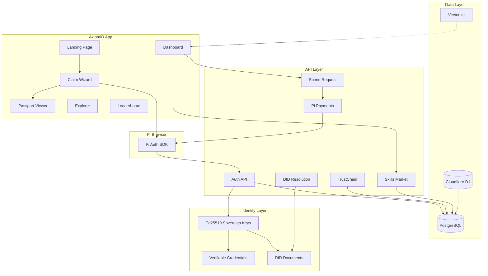

<div align="center">
  
</div>

<h1 align="center">
  AxiomID: The Human Authorization Protocol for AI Agents and Humans
</h1>

<p align="center">
  <em>Sovereign credentials, autonomous wallets, and dual-identity governance for the agentic web.</em>
</p>

<p align="center">
  <a href="https://axiomid.app"><b>Live App</b></a> ·
  <a href="https://axiomid.app/passport/demo"><b>Demo Passport</b></a> ·
  <a href="https://axiomid.app/leaderboard"><b>Leaderboard</b></a> ·
  <a href="https://github.com/Moeabdelaziz007/AxiomID"><b>GitHub</b></a>
</p>

<p align="center">
  <a href="https://github.com/Moeabdelaziz007/AxiomID/actions"></a>
  
  
  
  
  
  
  
  
  
  
  
  
  
  
</p>

---

AxiomID is a Next.js application that combines Pi Network authentication, passport-style identity claims, and a lightweight governance layer for human-AI collaboration.

## What is available now

- Pi Browser sign-in and callback handling
- Demo and real identity claim flows
- Public passport pages with trust and badge metadata
- Authenticated dashboard with marketplace, settings, and sandbox playground
- Explorer, leaderboard, docs, and service status views
- API routes for auth, passport publishing, Pi payments, and health checks
- **Spend Request** — agentic Pi payments pipeline (agent requests, user approves, Pi SDK executes)
- **TrustChain** — append-only hash chain for all agent actions
- **Truth RAG** — AI-powered Q&A over 6236 verses via Vectorize + Workers AI
- **Dual-Identity Governance** — explicit separation and cooperation of Human Sovereign and AI Agent nodes, verified via the protocol
- **Virtual Protocol site verification** (merged) — on-chain agent identity anchoring
- **PiVerify KYC integration** — external KYC stamp via PiVerify provider
- **SBT (Soulbound Token) minting** for Tier 1 — non-transferable on-chain credential
- **Dead code cleanup** — 24 files removed, reduced maintenance surface

## Architecture



## Routes

| Route | Purpose |
|:---|:---|
| `/` | Landing experience and entry point |
| `/claim` | Identity claim wizard |
| `/onboarding` | Onboarding flow for new users |
| `/passport/[slug]` | Public passport viewer |
| `/dashboard` | Authenticated dashboard |
| `/dashboard/settings` | User settings and VC viewer |
| `/agent/[username]` | Public agent profile |
| `/explorer` | Discover agents and identities |
| `/leaderboard` | Ranked trust and activity view |
| `/docs` | Product and API documentation |
| `/status` | Service health and dependency status |
| `/diagnostics` | Debug and diagnostic tools |
| `/about` | About AxiomID |
| `/privacy` | Privacy policy |
| `/terms` | Terms of service |
| `/offline` | Offline fallback page |
| `/signin/callback` | Pi sign-in callback handler |

### API Routes

| Endpoint | Purpose |
|:---|:---|
| `/api/auth/*` | Pi Browser authentication, connect, logout, state |
| `/api/passport/*` | Passport CRUD, publishing, verification |
| `/api/agent/*` | Agent identity, sign, activate, pause, manifest |
| `/api/agents` | List agents for the authenticated user |
| `/api/agents/harvest` | Query Perplexity for real-time agent harvesting |
| `/api/pi/*` | Pi payments (approve, complete), KYA claims, ad verification |
| `/api/skills/*` | Skills marketplace (CRUD, search, install, execute, pay, review) |
| `/api/spend-request` | Create, list, approve spend requests + SSE stream |
| `/api/health` | Health check |
| `/api/status` | Protocol metrics: users, agents, XP, payments |
| `/api/explorer` | Live explorer data and stats |
| `/api/leaderboard` | Top users ranked by XP |
| `/api/diagnostics/*` | Error capture and logs |
| `/api/sandbox/*` | Sandbox dev-token and code execution |
| `/api/admin/*` | Admin skills moderation |
| `/api/stamp/*` | Stamp claiming |
| `/api/social/disconnect` | Social account disconnection |
| `/api/sync` | Edge-to-PostgreSQL sync |
| `/api/telegram` | Telegram bot integration |
| `/api/stellar/anchor` | Stellar trust anchoring |
| `/api/vault/stake` | Vault staking |
| `/api/did-document` | DID document resolution |
| `/api/credential-status` | Credential revocation check |
| `/api/upload/presign` | Presigned upload URLs |
| `/api/presence/heartbeat` | Presence heartbeat |
| `/api/daily-review` | Daily review trigger |
| `/api/user/status` | User status |
| `/api/emulate/*` | Service emulation (dev) |

## Tech stack

| Layer | Technology |
|:---|:---|
| **Frontend** | Next.js 16 · React 19 · Framer Motion 12 · Tailwind 4 |
| **Backend** | Vercel Serverless · Cloudflare Workers |
| **Database** | PostgreSQL (Prisma 6) · D1 (edge sync) · Vectorize (semantic search) |
| **Cache** | Upstash Redis (rate limiting, session state) |
| **AI** | Workers AI — Llama 3.1 8B · BGE-base-en-v1.5 |
| **Auth** | Pi Network SDK · Ed25519 sovereign keys · W3C DID |
| **Storage** | Cloudflare KV · Vercel Blob |
| **State/Cache** | TanStack Query v5 (client-side cache) |
| **CI/CD** | GitHub Actions → Vercel · 3270+ tests |

## Quick start

```bash
git clone https://github.com/Moeabdelaziz007/AxiomID.git
cd AxiomID
npm install
cp .env.example .env.local
# Fill in: DATABASE_URL, PI_API_KEY, SOVEREIGN_KEY_SALT, auth secrets
npx prisma migrate deploy && npx prisma generate
npm run dev
```

Open http://localhost:3000.

### Pi Browser local HTTPS

The Pi SDK expects HTTPS in the browser. For local development, use portless:

```bash
npm install -g portless
portless axiomid next dev
# -> https://axiomid.localhost
```

### Backend (Cloudflare Worker)

```bash
cd backend && npm install
npx wrangler d1 execute axiomid-edge --remote --file=./migrations/0001_init.sql
echo "token" | npx wrangler secret put SHARED_SECRET_TOKEN_VERCEL_CF
npx wrangler deploy
```

## Verification and quality checks

```bash
npm run lint       # 0 errors, 0 warnings
npm run type-check # type check
npm test           # 3270+ tests (some page tests need QueryClientProvider wrapper)
```

## Project structure

```
src/
  app/
    api/           # Route handlers (Next.js App Router)
    dashboard/     # Authenticated dashboard
    passport/      # Public passport viewer
  components/      # Shared UI components
  lib/             # Auth, crypto, Pi SDK, validators, utilities
  i18n/            # Translation files (en.json, ar.json)
prisma/            # Schema and migrations
docs/              # Specs and architecture docs
AxiomID.Memory/    # Knowledge base and design docs
```

## Trust Tiers

| Tier | Price | XP | Features |
|:---|:---|:---|:---|
| 🟢 Visitor | Free | 0 | Limited read-only access |
| 🔵 Citizen | Free | 100 | Social stamps, basic agent access |
| 🟣 Validator | 25 PI | 500 | Agent delegation, marketplace install |
| 👑 Sovereign | 100 PI | 1000 | Full trust, vault staking, vouching power |

## Trust Score

Every identity on AxiomID has a **Trust Score** built from verified stamps and experience points (XP):

**Basic** (when tenure/semantic data is unavailable):
$$\text{Trust Score} = \text{XP Score} \times 0.7 + \text{Stamp Score} \times 0.3$$

**Full** (with tenure and semantic trust data):
$$\text{Trust Score} = \text{XP Score} \times 0.5 + \text{Stamp Score} \times 0.2 + \text{Tenure Score} \times 0.1 + \text{Semantic Trust} \times 0.2$$

Trust decays over time (inactivity penalty) and is boosted by Stellar anchoring (+15%).

## What AxiomID Does

| Layer | What It Does |
|:---|:---|
| **DID** | `did:axiom` — W3C-compliant, self-sovereign identity per user |
| **Verifiable Credentials** | Cryptographically signed stamps (social, KYA, KYC) |
| **Trust Engine** | Physics-inspired algorithm with decay and anchoring |
| **Agent Passports** | Public identity cards with verification badges and trust scores |
| **Spend Request** | Agentic Pi payments — agent requests, user approves, Pi SDK executes |
| **TrustChain** | Append-only hash chain for all agent actions |
| **Skills Marketplace** | Install capabilities for agents |
| **Truth RAG** | AI-powered Q&A over 6236 verses via Vectorize + Workers AI |
| **Soul System** | Six-gate ethical evaluation loop |

## OpenIdentity Integration

AxiomID integrates with [OpenIdentity](https://github.com/Moeabdelaziz007/openidentity.md) — a portable identity manifest for AI agents.

| Feature | Status |
|:---|:---|
| `did:axiom` DID method | ✅ Specified (W3C-compliant, Pi Network anchored) |
| OpenIdentity manifest | ✅ Supported |
| `/.well-known/openidentity` | 🚧 Planned |
| Agent card | ✅ A2A AgentCard endpoint |

**Spec:** [did:axiom DID Method v0.1](https://github.com/Moeabdelaziz007/openidentity.md/blob/main/spec/did-axiom-method-v0.1.md)

## Packages

| Package | Version | Description |
|:---|:---|:---|
| `@axiomid/crypto` | 0.1.0 | Ed25519 key derivation, signing, verification |
| `@axiomid/sdk` | 0.1.0 | Public API client — verify passports, resolve DIDs, query trust scores |

```bash
npm install @axiomid/sdk @axiomid/crypto
```

## Contributing

See [`CONTRIBUTING.md`](./CONTRIBUTING.md). PRs require passing CI.

```bash
git checkout -b feat/my-feature
# make changes
npm test && npm run lint && npx tsc --noEmit
git commit -m "feat(scope): description ۞"
git push origin feat/my-feature
```

## License

- **Application code:** Proprietary — All Rights Reserved © 2026 Mohamed Abdelaziz. See [`LICENSE`](./LICENSE).
- **`@axiomid/sdk`** and **`@axiomid/crypto`:** MIT licensed. Open for community use.

## Built By

<div align="center">

**AxiomID** is built by **Mohamed Abdelaziz** ([@Moeabdelaziz007](https://github.com/Moeabdelaziz007)).

Built with passion in Cairo, Egypt.

<a href="https://github.com/Moeabdelaziz007/AxiomID/graphs/contributors">
  
</a>

</div>

### Acknowledgments

**Pi Network** — For the authentication SDK and the vision of a human-centered web. Learn more at [minepi.com](https://minepi.com).

<div align="center">

<a href="https://minepi.com">
  
</a>
<a href="https://vercel.com">
  
</a>
<a href="https://www.cloudflare.com">
  
</a>
<a href="https://github.com/vercel/next.js">
  
</a>

</div>

---

<div align="center">

**[axiomid.app](https://axiomid.app)** · **[Claim your identity](https://axiomid.app/claim)**

<sub>Built with the belief that every human deserves a sovereign digital identity.</sub>

</div>

## Connect

- 🌐 [axiomid.app](https://axiomid.app)
- 📘 [Facebook Page](https://www.facebook.com/profile.php?id=61583477974464)
- 🐦 [GitHub](https://github.com/Moeabdelaziz007/AxiomID)
- 📋 [OpenIdentity Spec](https://github.com/Moeabdelaziz007/openidentity.md)
