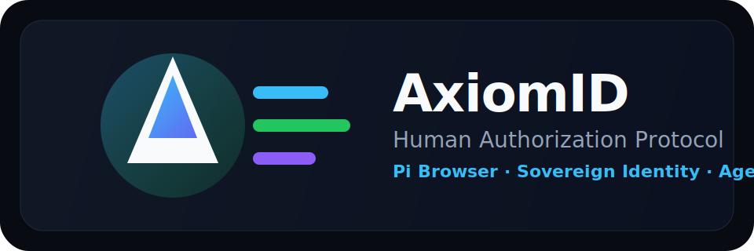

<div align="center">
  
</div>

<h1 align="center">
  AxiomID is the Human Authorization Protocol for AI agents and humans.
</h1>

<p align="center">
  <em>Pi Browser auth, sovereign passports, verifiable identity, and agent governance in one experience.</em>
</p>

<p align="center">
  <a href="https://axiomid.app"><b>🌐 Live App</b></a> ·
  <a href="https://axiomid.app/passport/demo"><b>🛂 Demo Passport</b></a> ·
  <a href="https://axiomid.app/leaderboard"><b>📊 Leaderboard</b></a> ·
  <a href="https://github.com/Moeabdelaziz007/AxiomID"><b>⭐ GitHub</b></a>
</p>

<p align="center">
  <a href="https://github.com/Moeabdelaziz007/AxiomID/actions"></a>
  
  
  
</p>

---

AxiomID is a Next.js application that combines Pi Network authentication, passport-style identity claims, and a lightweight governance layer for human-AI collaboration. The current MVP focuses on the core claim experience, public passport viewing, and the authenticated dashboard.

## What is available now

- Pi Browser sign-in and callback handling
- Demo and real identity claim flows
- Public passport pages with trust and badge metadata
- Authenticated dashboard with marketplace, settings, and sandbox playground
- Explorer, leaderboard, docs, and service status views
- API routes for auth, passport publishing, Pi payments, and health checks

## Main routes

| Route | Purpose |
|:---|:---|
| `/` | Landing experience and entry point |
| `/claim` | Identity claim wizard |
| `/passport/[slug]` | Public passport viewer |
| `/dashboard` | Authenticated dashboard |
| `/explorer` | Discover agents and identities |
| `/leaderboard` | Ranked trust and activity view |
| `/docs` | Product and API documentation |
| `/status` | Service health and dependency status |

## Tech stack

- Frontend: Next.js 16, React 19, TypeScript, Tailwind CSS, Framer Motion
- Backend: Vercel serverless routes and Cloudflare Worker integrations
- Data: Prisma + PostgreSQL, plus D1/edge helpers for sync workflows
- Identity: Pi Network SDK, signed agent metadata, and sovereign key utilities

## Quick start

```bash
git clone https://github.com/Moeabdelaziz007/AxiomID.git
cd AxiomID
npm install
```

Create a local environment file before running the app:

```bash
cp .env.example .env.local
```

If that file does not exist in your environment, create one manually with the variables required by the app, including the database and Pi-related settings.

```bash
npx prisma generate
npm run dev
```

Open http://localhost:3000.

### Pi Browser local HTTPS

The Pi SDK expects HTTPS in the browser. For local development, use portless:

```bash
npm install -g portless
portless axiomid next dev
```

This will expose a secure local URL such as https://axiomid.localhost.

## Verification and quality checks

```bash
npm run lint
npm run type-check
npm test
```

## Project structure

- [src/app](src/app) — app routes, pages, and API handlers
- [src/components](src/components) — shared UI components
- [src/lib](src/lib) — auth, crypto, Pi SDK, validators, and utilities
- [backend](backend) — Cloudflare Worker backend package
- [prisma](prisma) — Prisma schema and migrations
- [public](public) — PWA assets, icons, and public branding files

## Contributing

Please review [CONTRIBUTING.md](CONTRIBUTING.md) before opening a pull request. The project uses strict TypeScript settings and expects quality checks to pass locally.

## License

- Application code: Proprietary — All Rights Reserved © 2026 Mohamed Abdelaziz. See [LICENSE](LICENSE).
- SDK and crypto packages in this repository remain open for community use under their own licenses.

## Legacy notes

Every identity on AxiomID has a **Trust Score** — an algorithmic reputation built from verified stamps and experience points (XP).

### Trust Calculation Formulas
AxiomID uses a dual-calculation mode based on input parameters (defined in [trust.ts](file:///Users/cryptojoker710/Desktop/AxiomID/src/lib/trust.ts)):

1. **Standard Mode (Fallback):**
   $$\text{Trust Score} = \text{XP Score} \times 0.7 + \text{Stamp Score} \times 0.3$$
   *(Clamped to 0-100)*

2. **Advanced Multi-Dimensional Mode (with Tenure & Semantics):**
   $$\text{Trust Score} = \text{XP Score} \times 0.5 + \text{Stamp Score} \times 0.2 + \text{Tenure Score} \times 0.1 + \text{Semantic Trust} \times 0.2$$
   - **Tenure:** Up to 50 days (2% per day, capped at 100%).
   - **Semantic Trust:** Dynamically computed based on agent reputation and peer vouches (0-100).

### API Passport Example

**Live endpoint:** [`GET /api/passport/demo`](https://axiomid.app/api/passport/demo) — returns the complete passport JSON:

```json
{
  "username": "AxiomID Agent",
  "walletAddress": "GD5...3H",
  "stellarAddress": "GB6...4K",
  "did": "did:axiom:pi:user123",
  "tier": "Sovereign",
  "xp": 1200,
  "trustScore": 94,
  "kyaStatus": "VERIFIED",
  "kycStatus": "VERIFIED",
  "stamps": [
    { "type": "KYA", "provider": "pi_network" },
    { "type": "WALLET_AGE", "provider": "stellar" }
  ],
  "issuedDate": "2026-06-25T12:00:00.000Z",
  "agentName": "SovereignNode1",
  "agentStatus": "ACTIVE",
  "agentPublicKey": "MGP..."
}
```

---

## Passport Example

When a user claims their identity, they get a **Sovereign Passport**:

| Field | Value |
|:---|:---|
| **DID** | `did:axiom:axiomid.app:pi:{uid}` |
| **Tier** | Visitor → Citizen → Validator → **Sovereign** |
| **Trust Score** | 0–100 (XP 70% + verified stamps 30%) |
| **Stamps** | KYA, Social, Pi Wallet, Agent Delegation |
| **Attestations** | Peer-signed reputation vouches |

**Claim yours in 3 steps:**

<div align="center">

| Step | Action | Time |
|:---:|:---|:---:|
| **1** | Connect Pi Wallet | 10s |
| **2** | Link Social Accounts | 30s |
| **3** | Deploy Your Agent | Instant |

</div>

Open [`axiomid.app/claim`](https://axiomid.app/claim) in **Pi Browser** or any modern browser.

---

## What AxiomID Does

| Layer | What It Does |
|:---|:---|
| **DID** | `did:axiom` — W3C-compliant, self-sovereign identity per user |
| **Verifiable Credentials** | Cryptographically signed stamps (social, KYA, KYC). Each stamp is a VC. |
| **Trust Engine** | Physics-inspired algorithm — trust score = `XP (70%) + stamps (30%)` |
| **Agent Passports** | Public identity cards with verification badges, trust scores, and attestation history |
| **Skills Marketplace** | Install capabilities for agents. Agents execute skills in isolated sandboxes. |
| **Truth RAG** | AI-powered Q&A over 6236 verses via Vectorize + Workers AI |
| **Soul System** | Six-gate ethical evaluation loop — Vigilance, Correction, Ledger, Triad, Septet, Compounding |

### The Soul System (6 Ethical Gates)

AI Agent execution and code validation inside AxiomID are strictly guarded by the **Soul System** — a six-gate ethical evaluation loop designed to enforce sovereign safety, auditability, and absolute alignment (defined in [AGENTS.md](file:///Users/cryptojoker710/Desktop/AxiomID/AGENTS.md)):

1. **Vigilance (Self Awareness):** Absolute intention verification. Every mutating action is logged.
2. **Correction (Self-Correction):** Fail-safe error tracking, logging, and proactive remediation logic.
3. **Ledger (The Guardian):** Append-only logs and hash chains ensure nothing is lost or forged.
4. **Triad (Self-Healing):** Three-cycle retry pattern for automated recovery from transient failures.
5. **Septet (Cycle Learning):** Holistic reflection and synthesis every 7 cycles to balance security vs usability.
6. **Compounding (Barakah):** Consistency-driven growth where trust compounds at key milestones.

### Dynamic Sandbox Mode

AxiomID automatically determines if the SDK operates in Sandbox mode via a fallback cascade sequence (implemented in [pi-sdk.ts](file:///Users/cryptojoker710/Desktop/AxiomID/src/lib/pi-sdk.ts)):

1. **Environment Variables:** Presence of `NEXT_PUBLIC_SANDBOX_DEV_TOKEN` configuration (development only).
2. **Hostname Check:** Dynamic checks for localhost, local LAN networks, or staging domains.
3. **Iframe Referrer:** If the frame parent is `sandbox.minepi.com`.
4. **Query Parameter:** Direct presence of the `?sandbox=true` parameter in the URL.

*Note: In production environments on custom domains (e.g. `axiomid.app`), sandbox mode is strictly disabled for security.*

---

## SDK

```bash
npm install @axiomid/sdk
```

```typescript
import { AxiomSDK } from "@axiomid/sdk";

// Initialize the SDK instance
const sdk = new AxiomSDK({ network: "mainnet" });

// Retrieve the verified trust score for a DID
const trust = await sdk.getTrustScore("did:axiom:pi:user123");
// { did: "did:axiom:pi:user123", score: 94, tier: "Sovereign" }

// Retrieve and verify the full sovereign passport
const passport = await sdk.verifyPassport("did:axiom:pi:user123");
// returns complete Passport object (username, did, stamps, trustScore, etc.)
```

---

## Quick Start

```bash
git clone https://github.com/Moeabdelaziz007/AxiomID.git
cd AxiomID
npm install
cp .env.example .env.local
# Fill in: DATABASE_URL, PI_API_KEY, SOVEREIGN_KEY_SALT, auth secrets
npx prisma migrate deploy && npx prisma generate
npm run dev
```

Open [http://localhost:3000](http://localhost:3000).

### Backend (Cloudflare Worker)

```bash
cd backend && npm install
npx wrangler d1 execute axiomid-edge --remote --file=./migrations/0001_init.sql
echo "token" | npx wrangler secret put SHARED_SECRET_TOKEN_VERCEL_CF
npx wrangler deploy
```

### Local HTTPS Emulation for Pi Browser

Since the Pi Network SDK requires HTTPS in the browser environment, plain `http://localhost:3000` will fail silently in the Pi Browser. Use `portless` to spin up a local HTTPS gateway with auto-trusted certificates:

```bash
# Install portless globally (one-time)
npm install -g portless

# Run local HTTPS proxy pointing next dev
portless axiomid next dev
# -> https://axiomid.localhost
```

---

## Pages

| Route | Description |
|:---|:---|
| `/` | Landing — live network stats, trust tiers, hero |
| `/passport/[slug]` | Public passport viewer with OG metadata |
| `/claim` | 3-step onboarding (Connect → Verify → Deploy) |
| `/dashboard` | Authenticated dashboard with marketplace, settings |
| `/explorer` | Browse all registered agents |
| `/leaderboard` | Top 50 users ranked by XP |
| `/docs` | Full docs — stamps, SDK, API reference |
| `/status` | Live service health (DB, Stellar, Pi, Workers AI) |

---

## Trust Tiers

| Tier | XP | Access |
|:---|:---:|:---|
| **Visitor** | 0 | Limited. Basic read-only. |
| **Citizen** | 100 | Social stamps, basic agent access. |
| **Validator** | 500 | Agent delegation, marketplace install. |
| **Sovereign** | 1000 | Full trust, vault staking, vouching power. |

---

## Tech Stack

| Layer | Technology |
|:---|:---|
| **Frontend** | Next.js 16 · React 19 · Framer Motion 12 · Tailwind 4 |
| **Backend** | Vercel Serverless · Cloudflare Workers |
| **Database** | PostgreSQL (Prisma 6) · D1 (edge sync) · Vectorize (semantic search) |
| **AI** | Workers AI — Llama 3.1 8B · BGE-small-en-v1.5 |
| **Auth** | Pi Network SDK · Ed25519 sovereign keys · W3C DID |
| **Storage** | Cloudflare KV · Vercel Blob |
| **CI/CD** | GitHub Actions → Vercel · 3073 tests, 134 suites |

---

## Testing

```bash
npm test           # 3073 tests, 134 suites
npm run lint       # 0 errors, 0 warnings
npx tsc --noEmit   # type check
```

---

## Contributing

See [`CONTRIBUTING.md`](./CONTRIBUTING.md). PRs require passing CI.

```bash
git checkout -b feat/my-feature
# make changes
npm test && npm run lint && npx tsc --noEmit
git commit -m "feat(scope): description ۞"
git push origin feat/my-feature
```

---

## License

- **Application code:** Proprietary — All Rights Reserved © 2026 Mohamed Abdelaziz. See [`LICENSE`](./LICENSE).
- **`@axiomid/sdk`** and **`@axiomid/crypto`:** MIT licensed. Open for community use.
