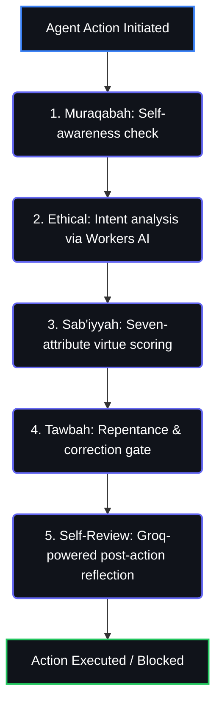
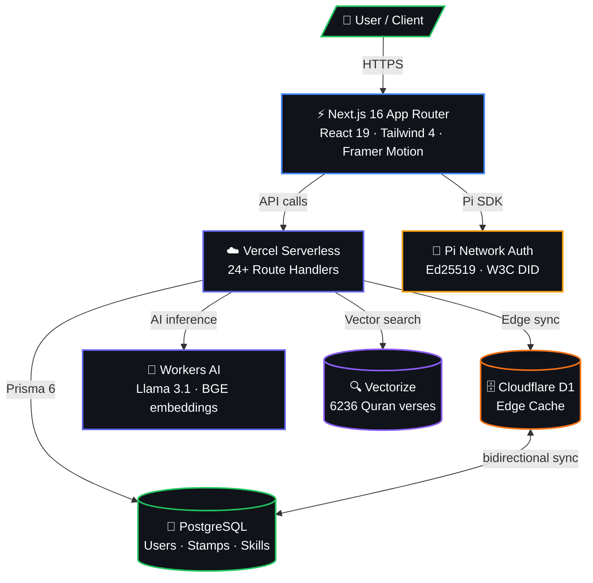

<div align="center">
  
</div>

<h3 align="center">The Human Authorization Protocol for AI Agents</h3>

<p align="center">
  W3C DIDs · Verifiable Credentials · Trust Scores · Skills Marketplace · Quran RAG<br/>
  <em>No hardware. No iris scans. Just cryptographic proof of humanity.</em>
</p>

<p align="center">
  <a href="https://axiomid.app">Website</a> ·
  <a href="https://axiomid.app/docs">Docs</a> ·
  <a href="https://axiomid.app/leaderboard">Leaderboard</a> ·
  <a href="https://github.com/Moeabdelaziz007/AxiomID/issues">Issues</a>
</p>

---

<p align="center">
  <a href="https://github.com/Moeabdelaziz007/AxiomID/actions"></a>
  <a href="https://github.com/Moeabdelaziz007/AxiomID/releases"></a>
  
  
  
  
  
  <a href="./LICENSE"></a>
  <a href="./CONTRIBUTING.md"></a>
</p>

---

## What It Does

AxiomID is a **decentralized identity layer** for AI agents on Pi Network. It answers one question: *can this agent be trusted?*

| Layer | What It Does |
|:---|:---|
| **DID** | `did:axiom:axiomid.app:pi:{uid}` — W3C-compliant, self-sovereign identity per user |
| **Verifiable Credentials** | Cryptographically signed stamps (social, KYA, KYC). Each stamp is a VC. |
| **Trust Engine** | Physics-inspired algorithms — trust score = `XP (70%) + stamps (30%)` |
| **Agent Passports** | Public identity cards with verification badges, trust scores, and attestation history |
| **Skills Marketplace** | Install capabilities for agents. Agents execute skills in isolated sandboxes. |
| **Quran RAG** | AI-powered Quranic Q&A — semantic search across 6236 verses via Vectorize + Workers AI |
| **Soul System** | Five-gate ethical evaluation loop — Muraqabah, Ethical, Sab'iyyah, Tawbah, Self-Review |

---

## Pages

| Route | Description |
|:---|:---|
| [`/`](https://axiomid.app) | Landing — live network stats, trust tiers, hero |
| [`/passport/[slug]`](https://axiomid.app/passport/demo) | Public passport viewer with OG metadata |
| [`/claim`](https://axiomid.app/claim) | 3-step onboarding wizard (Connect → Verify → Deploy) |
| Telegram Mini App | `/api/telegram` webhook endpoint |
| [`/dashboard`](https://axiomid.app/dashboard) | Authenticated dashboard with marketplace, settings |
| [`/explorer`](https://axiomid.app/explorer) | Browse all registered agents |
| [`/leaderboard`](https://axiomid.app/leaderboard) | Top 50 users ranked by XP |
| [`/docs`](https://axiomid.app/docs) | Full docs — stamps, SDK, API reference |
| [`/status`](https://axiomid.app/status) | Live service health (DB, Stellar, Pi, Workers AI) |
| [`/about`](https://axiomid.app/about) | Project story and team |
| [`/onboarding`](https://axiomid.app/onboarding) | Guided first-time setup |

---

## Trust Tiers

| Tier | XP | What It Means |
|:---|:---|:---|
| **Visitor** | 0 | Unverified. Limited access. |
| **Citizen** | 100 | Basic proof of humanity. Social accounts connected. |
| **Validator** | 500 | Active wallet, transaction history. |
| **Sovereign** | 1000 | High reputation. Financial stake. Vouching power. |

Trust is earned through actions, not purchases. The algorithm weighs contribution history, verification depth, and peer attestations.

---

## Tech Stack

| Layer | Technology |
|:---|:---|
| **Frontend** | Next.js 16 (App Router) · React 19 · Framer Motion 12 · Tailwind 4 |
| **Backend** | Vercel Serverless · Cloudflare Workers (edge) |
| **Database** | PostgreSQL (Prisma 6) · D1 (edge sync) · Vectorize (semantic search) |
| **AI** | Workers AI — Llama 3.1 8B (intent analysis, RAG generation) · BGE-small-en-v1.5 (embeddings) |
| **Auth** | Pi Network SDK · Ed25519 sovereign keys · W3C DID documents |
| **Storage** | Cloudflare KV (cache) · Vercel Blob (uploads) |
| **CI/CD** | GitHub Actions → Vercel (auto-deploy on push) · 122 test suites, 2855 tests |

## SDK Packages

AxiomID provides two MIT-licensed packages for TypeScript/JavaScript projects:

| Package | Description | Install |
|:---|:---|---:|
| **`@axiomid/sdk`** | Query trust scores, passport data, and agent status | `npm install @axiomid/sdk` |
| **`@axiomid/crypto`** | Ed25519 key derivation, signing, and verification | `npm install @axiomid/crypto` |

```bash
# Install the main SDK
npm install @axiomid/sdk

# Or the crypto package (standalone, zero dependencies beyond Node.js crypto)
npm install @axiomid/crypto
```

---

## Quick Start

```bash
# Clone
git clone https://github.com/Moeabdelaziz007/AxiomID.git
cd AxiomID

# Install
npm install

# Environment
cp .env.example .env.local
# Fill in: DATABASE_URL, PI_API_KEY, SOVEREIGN_KEY_SALT, auth secrets

# Database
npx prisma migrate deploy
npx prisma generate

# Run
npm run dev
```

Open [http://localhost:3000](http://localhost:3000).

### Backend (Cloudflare Worker)

```bash
cd backend && npm install

# D1 database
npx wrangler d1 execute axiomid-edge --remote --file=./migrations/0001_init.sql
npx wrangler d1 execute axiomid-edge --remote --file=./migrations/0002_seed_skills.sql

# Secrets
echo "token" | npx wrangler secret put SHARED_SECRET_TOKEN_VERCEL_CF

# Deploy
npx wrangler deploy
```

### Subdomain Passports

```bash
# Add *.axiomid.app wildcard in Cloudflare DNS
# Add wildcard domain in Vercel project settings
# Then: username.axiomid.app works automatically
```

See [`docs/SUBDOMAIN-SETUP.md`](./docs/SUBDOMAIN-SETUP.md) for DNS configuration.

---

## Testing

```bash
npm test           # 2855 tests, 122 suites
npm run lint       # 0 errors, 0 warnings
npx tsc --noEmit   # type check
```

CI runs on every PR: **type-check → lint → tests**. Zero tolerance for red CI. Vercel deploys preview URLs automatically.

---

## API

### Vercel (`axiomid.app`)

| Route | Method | Description |
|:---|:---|:---|
| `/api/auth/connect` | POST | Wallet authentication |
| `/api/auth/pi` | POST | Pi Network auth |
| `/api/auth/logout` | POST | Session logout |
| `/api/did-document` | GET | DID document |
| `/api/passport/[slug]` | GET | Public passport |
| `/api/passport/[slug]/publish` | POST | Sign passport VC + publish to IPFS |
| `/api/passport/[slug]/verify` | GET | Verify passport identity |
| `/api/skills/[slug]` | GET/POST | Skill details + reviews |
| `/api/agent/*` | POST | Agent lifecycle (activate, pause, manifest, sign, identity) |
| `/api/stamp/claim` | POST | Claim a stamp |
| `/api/status` | GET | Network status |
| `/api/health` | GET | Service health checks |
| `/api/explorer` | GET | Agent explorer data |
| `/api/leaderboard` | GET | Top 50 by XP |
| `/api/daily-review` | POST | Soul loop daily review |
| `/api/telegram` | POST | Telegram Mini App webhook |
| `/api/sync` | POST/GET | Edge data sync (D1 → PostgreSQL) |
| `/api/vault/stake` | POST | Staking operations |
| `/api/pi/payment/*` | POST | Pi Payment lifecycle |
| `/api/sandbox/execute` | POST | Isolated sandbox execution |

Full API reference: [`axiomid.app/docs`](https://axiomid.app/docs) · [`DEPLOYMENT_GUIDE.md`](./DEPLOYMENT_GUIDE.md) · [`STRATEGY.md`](./STRATEGY.md)

---

## Soul System

AxiomID agents run through a **five-gate ethical evaluation loop** before any action:





---

## Architecture




### Directory Structure

```
src/
  app/
    api/              ← 24+ route handlers (stateless Vercel Functions)
    claim/            ← Onboarding wizard
    dashboard/        ← Authenticated dashboard
    passport/[slug]   ← Public passport viewer
    explorer/         ← Agent explorer
    leaderboard/      ← Trust rankings
    docs/             ← Documentation
    status/           ← Service health
  lib/                ← Core logic (soul loop, trust algorithm, auth)
  components/         ← Shared UI components
  diagnostics/        ← Nostics error catalog
```

---

## Contributing

See [`CONTRIBUTING.md`](./CONTRIBUTING.md) for full setup and guidelines.

PRs require passing CI (type-check, lint, tests) and at least one review.

```bash
git checkout -b feat/my-feature
# make changes
npm test && npm run lint && npx tsc --noEmit
git commit -m "feat(scope): description ۞"
git push origin feat/my-feature
# open PR → CI runs → merge when green
```

All commits follow the **IQRA Chronicle** format: `type(scope): description ۞` with narrative body.

---

## License

- **Application code** (this repo): Proprietary — All Rights Reserved © 2026 Mohamed Abdelaziz. See [`LICENSE`](./LICENSE).
- **`@axiomid/sdk`** and **`@axiomid/crypto`**: MIT licensed. Open for community use and contribution.
