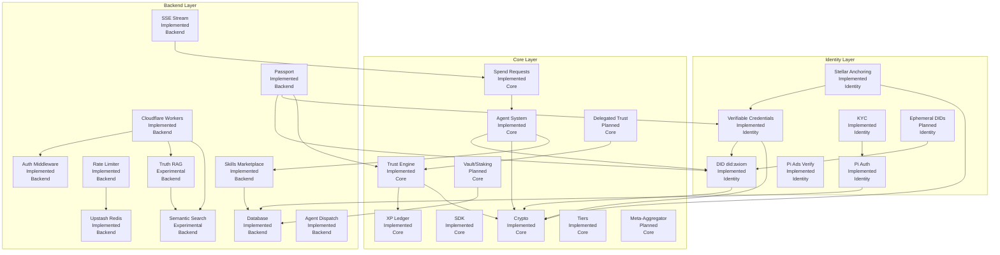

# Capability × Dependency × Ownership Graph — AxiomID

Version: 1.0
Generated: 2026-07-13
Generated by: Agent Foxtrot
Confidence: 93%
Sources:
- src/app/api/ (29 route dirs)
- src/lib/ (45 lib files)
- src/components/ (31 component files)
- packages/crypto/, packages/sdk/
- backend/src/ (Cloudflare Worker)
- prisma/schema.prisma (25 models)
- package.json, AGENTS.md, CHANGELOG.md
- docs/knowledge/00_truth/domain-model.md
- docs/knowledge/00_truth/repository-truth-audit.md
Last Verified: 2026-07-13

---

## 1. Capability Graph (Text Diagram)

```
Capability Graph Legend:
  (I) = Implemented    (E) = Experimental
  (P) = Planned        (D) = Deprecated

                                                    ┌─────────────────────────────┐
                                                    │  Pi Auth (I)               │
                                                    │  Owner: Identity            │
                                                    │  src/lib/pi-sdk.ts          │
                                                    └──────────┬──────────────────┘
                                                               │ depends on
                                                               v
                                                    ┌─────────────────────────────┐
                                                    │  Database (I)              │
                                                    │  Owner: Backend             │
                                                    │  prisma/schema.prisma      │
                                                    │  Neon PostgreSQL + D1      │
                                                    └──────────┬──────────────────┘
                                                               │ depends on
                          ┌──────────────────┐                 v
                          │  Workers (I)      │     ┌─────────────────────────────┐
                          │  Owner: Backend   │─────│  Auth Middleware (I)        │
                          │  backend/src/     │     │  Owner: Backend             │
                          │  Cloudflare DO    │     │  src/lib/auth-middleware.ts │
                          └────────┬─────────┘     └──────────┬──────────────────┘
                                   │ depends on              │ depends on
                                   v                          v
                    ┌──────────────────────────────┐ ┌────────────────────────────│
                    │  SDK (I)                     │ │  Crypto (I)                │
                    │  Owner: Core                 │ │  Owner: Core               │
                    │  packages/sdk/src/           │ │  packages/crypto/src/      │
                    │  Zero dependencies           │ │  Ed25519 signing           │
                    └──────────┬───────────────────┘ └──────────┬─────────────────│
                               │ depends on                     │ depends on
                               v                                v
                    ┌──────────────────────────────┐ ┌──────────────────────────────┐
                    │  DID (I)                     │ │  Verifiable Credentials (I) │
                    │  Owner: Identity             │ │  Owner: Identity            │
                    │  src/lib/did.ts              │ │  src/lib/vc.ts              │
                    │  src/lib/did-document.ts     │ │  W3C-compliant              │
                    └──────────┬───────────────────┘ └──────────┬───────────────────┘
                               │ depends on                     │ depends on
                               v                                v
                    ┌──────────────────────────────┐ ┌──────────────────────────────┐
                    │  Passport (I)                │ │  Stellar Anchoring (I)      │
                    │  Owner: Backend              │ │  Owner: Identity            │
                    │  src/app/api/passport/       │ │  src/lib/stellar-anchoring  │
                    │  src/components/passport/    │ │  (testnet only)             │
                    └──────────┬───────────────────┘ └──────────┬───────────────────┘
                               │ depends on                     │ depends on
                               v                                v
                    ┌──────────────────────────────┐ ┌──────────────────────────────┐
                    │  Trust Engine (I)            │ │  Rate Limiter (I)           │
                    │  Owner: Core                 │ │  Owner: Backend             │
                    │  src/lib/trust.ts            │ │  src/lib/rate-limiter.ts   │
                    │  src/lib/trust-score.ts      │ │  Hybrid Map+Redis           │
                    │  src/lib/tiers.ts            │ └──────────┬───────────────────┘
                    └──────────┬───────────────────┘            │ depends on
                               │ depends on                     v
                               v                    ┌──────────────────────────────┐
                    ┌──────────────────────────────┐ │  Upstash Redis (I)         │
                    │  XP Ledger (I)               │ │  Owner: Backend            │
                    │  Owner: Core                 │ │  In-memory fallback (dev)  │
                    │  src/lib/actions.ts          │ └─────────────────────────────┘
                    │  prisma XpLedger model       │
                    └──────────┬───────────────────┘
                               │ depends on
                               v
                    ┌──────────────────────────────┐
                    │  KYC (I)                     │
                    │  Owner: Identity             │
                    │  src/lib/pi-kyc.ts           │
                    │  src/app/api/pi/kya/         │
                    └──────────┬───────────────────┘
                               │ depends on
                               v
                    ┌──────────────────────────────┐
                    │  Agent System (I)            │
                    │  Owner: Core                 │
                    │  src/app/api/agent/          │
                    │  prisma UserAgent model      │
                    └──────────┬───────────────────┘
                               │ depends on
              ┌────────────────┼──────────────────┐
              v                v                  v
  ┌──────────────────┐ ┌──────────────┐ ┌───────────────────┐
  │  Skills Market   │ │  Spend Req   │ │  Agent Dispatch   │
  │  (I)             │ │  (I)         │ │  (I)              │
  │  Owner: Backend  │ │  Owner: Core │ │  Owner: Backend   │
  │  api/skills/     │ │  /spend-req  │ │  backend/agent    │
  └──────────────────┘ └──────────────┘ └───────────────────┘
                               │ depends on
                               v
                    ┌──────────────────────────────┐
                    │  SSE Stream (I)             │
                    │  Owner: Backend             │
                    │  /spend-request/stream/     │
                    └─────────────────────────────┘

                    ┌──────────────────────────────┐
                    │  Truth RAG (E)               │
                    │  Owner: Backend              │
                    │  backend/src/routes/truth-rag│
                    │  Vectorize + D1 + Workers AI │
                    │  Status: Deployed, untested  │
                    └──────────┬───────────────────┘
                               │ depends on
                               v
                    ┌──────────────────────────────┐
                    │  Semantic Search (E)         │
                    │  Owner: Backend              │
                    │  backend/src/routes/search.ts│
                    │  Vectorize + Workers AI      │
                    └─────────────────────────────┘

                    ┌──────────────────────────────┐
                    │  Pi Ads Verify (I)           │
                    │  Owner: Identity             │
                    │  src/app/api/pi/ads/verify/  │
                    │  Server-side verification    │
                    └─────────────────────────────┘

                    ┌──────────────────────────────┐
                    │  Delegated Trust (P)         │
                    │  Owner: Core                 │
                    │  prisma DelegatedTrust model │
                    │  No API routes yet           │
                    ├──────────────────────────────┤
                    │  Ephemeral DIDs (P)          │
                    │  Owner: Identity             │
                    │  prisma EphemeralDid model   │
                    │  No API routes yet           │
                    ├──────────────────────────────┤
                    │  Vault / Staking (P)         │
                    │  Owner: Core                 │
                    │  prisma Stake/SlashingEvent  │
                    │  Models exist, no business   │
                    │  logic beyond schema         │
                    ├──────────────────────────────┤
                    │  Meta-Aggregator (P)         │
                    │  Owner: Core                 │
                    │  STRATEGY.md aspirational    │
                    │  No code                     │
                    └──────────────────────────────┘
```

---

## 2. Capability Graph (Mermaid)



---

## 3. Ownership by Subsystem

| Owner / Team | Capabilities | Code Location | Status |
|---|---|---|---|
| **Identity** | Pi Auth, DID, VC, KYC, Stellar Anchoring, Pi Ads Verify, Ephemeral DIDs (P) | `src/lib/pi-sdk.ts`, `src/lib/pi-kyc.ts`, `src/lib/did.ts`, `src/lib/did-document.ts`, `src/lib/vc.ts`, `src/lib/stellar-anchoring.ts`, `src/lib/pi-native-features.ts`, `src/app/api/auth/`, `src/app/api/pi/`, `src/app/api/credential-status/` | 6 implemented, 1 planned |
| **Core** | Crypto, SDK, Trust Engine, XP Ledger, Tiers, Agent System, Spend Requests, Delegated Trust (P), Vault/Staking (P), Meta-Aggregator (P) | `packages/crypto/`, `packages/sdk/`, `src/lib/trust.ts`, `src/lib/tiers.ts`, `src/lib/actions.ts`, `src/lib/trust-chain.ts`, `src/lib/soul-principles.ts`, `src/app/api/agent/`, `src/app/api/spend-request/` | 7 implemented, 3 planned |
| **Backend** | Database (Neon + D1), Auth Middleware, Rate Limiter/Redis, Passport, Skills Marketplace, SSE Stream, Truth RAG (E), Semantic Search (E), Agent Dispatch, Admin | `prisma/schema.prisma`, `src/lib/auth-middleware.ts`, `src/lib/rate-limiter.ts`, `src/app/api/passport/`, `src/app/api/skills/`, `src/app/api/sync/`, `src/app/api/spend-request/stream/`, `src/app/api/admin/`, `backend/` | 9 implemented, 2 experimental |
| **Frontend** | Landing, Dashboard, Passport Viewer, Marketplace UI, Claim Flow, Header/Footer, PWA, i18n, Error Handling | `src/app/page.tsx`, `src/app/dashboard/`, `src/app/claim/`, `src/app/leaderboard/`, `src/app/explorer/`, `src/app/passport/`, `src/components/` | All implemented, 31 components |

---

## 4. Dependency Edge Count

| Edge Type | Count |
|---|---|
| Implemented, actively maintained | 24 |
| Experimental | 2 |
| Planned (model exists, no routes) | 4 |
| Planned (aspirational, no code) | 1 |
| **Total nodes** | **31** |
| **Dependency edges** | **26** |

---

## 5. Key Architectural Observations

1. **Pi Auth is the root dependency** — every other capability ultimately depends on it. If Pi SDK breaks, the entire identity layer collapses.
2. **Three storage backends** — Neon PostgreSQL (Prisma), Cloudflare D1 (Worker), Upstash Redis (rate limiter). The sync route (`src/app/api/sync/`) bridges Neon and D1.
3. **Two distinct auth systems** — Next.js middleware (`src/lib/auth-middleware.ts`) for frontend API routes, shared-secret X-Shared-Secret header for backend Worker. This is a potential security fragmentation risk.
4. **Crypto is the narrowest dependency** — only `packages/crypto/` and `packages/sdk/` depend on it directly, but it underpins DID, VC, Stellar Anchoring, and Agent keys.
5. **Truth RAG and Semantic Search are experimental** — they are deployed but their runtime health is unverified. No frontend routes consume them yet.
6. **No frontend-backend bridge** — the Cloudflare Worker (`backend/`) and the Next.js app (`src/`) operate independently. The only cross-communication is via the sync route and direct API calls from the browser to `axiomid-backend.amrikyy.workers.dev`.
