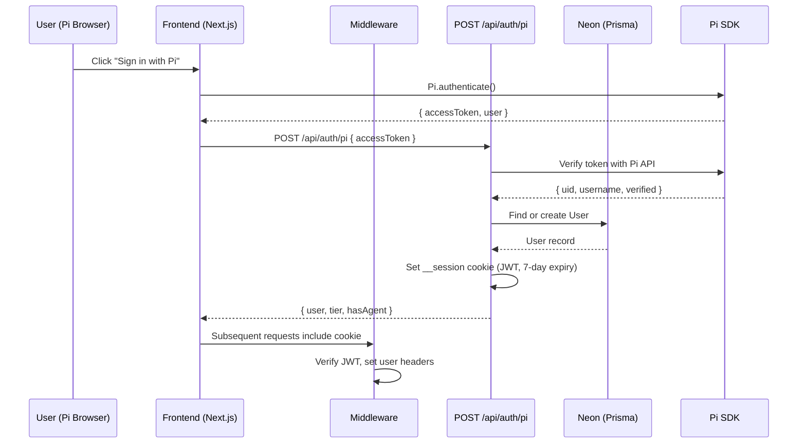
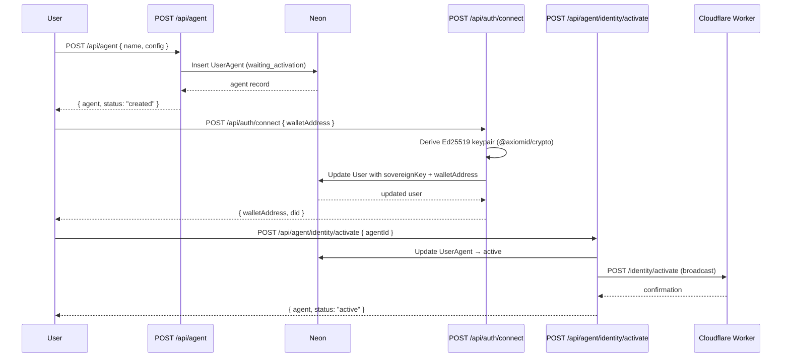
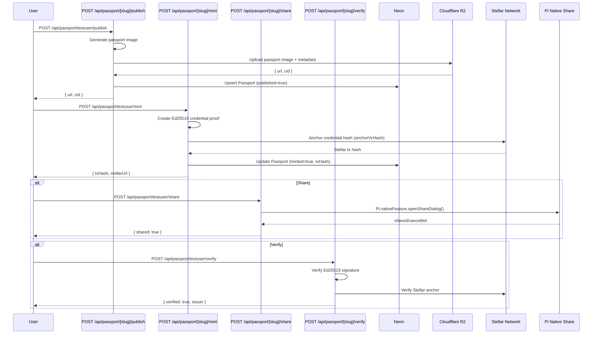
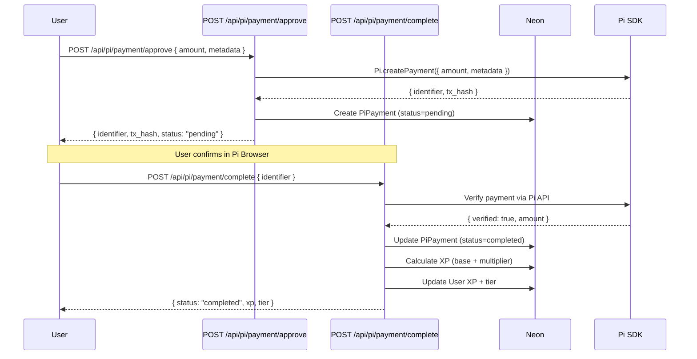
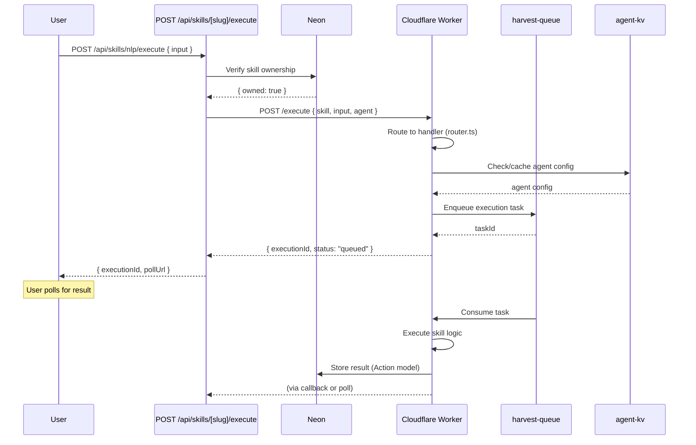
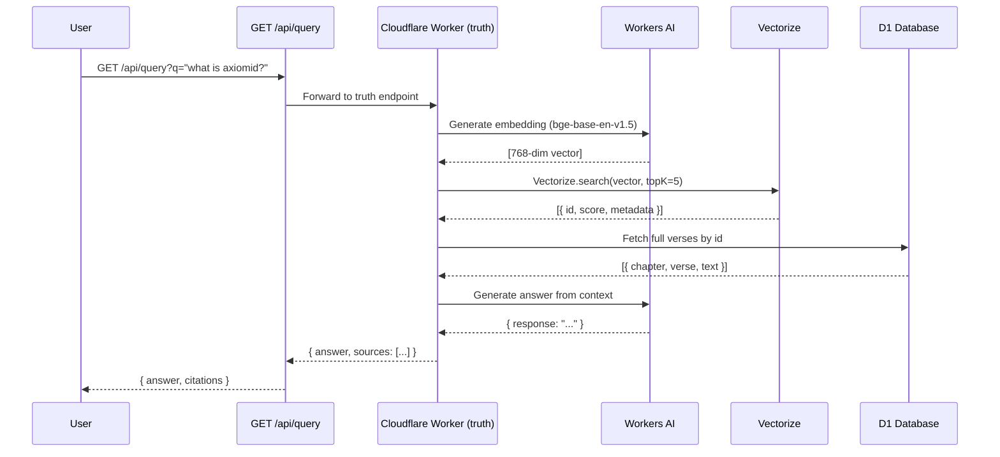
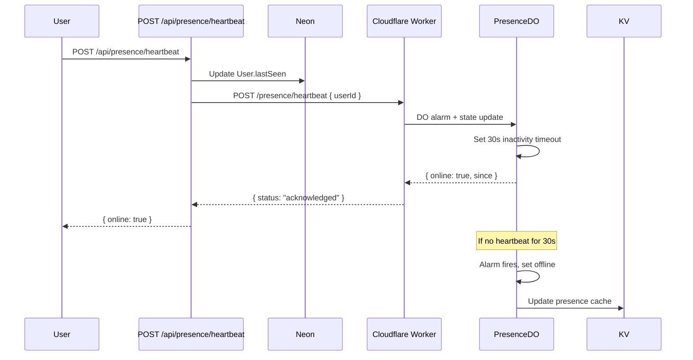
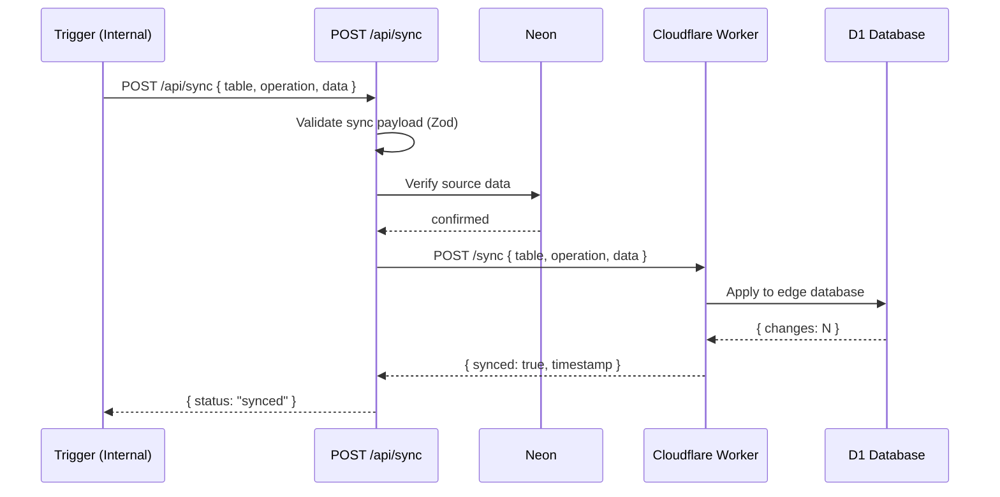

# Data Flow Map — Per-Feature Data Flows

- **Version:** 1.0
- **Generated:** 2026-07-13
- **Agent:** Delta (Phase 3)
- **Confidence:** 95%
- **Sources:** `src/app/api/*/route.ts`, `src/middleware.ts`, `backend/src/router.ts`, `backend/src/index.ts`, `prisma/schema.prisma`
- **Last Verified:** 2026-07-13

## 1. User Authentication Flow

**Data stored:** User (uid, username, walletAddress, stellarAddress, piUid, piUsername, tier, xp, did, kycStatus, hasAgent)
**Entry point:** `src/app/api/auth/pi/route.ts:30-80`
**Middleware:** `src/middleware.ts:108-135`

## 2. Agent Creation & Identity Flow

**Entry points:**
- Agent creation: `src/app/api/agent/route.ts:25-90`
- Wallet connect: `src/app/api/auth/connect/route.ts:45-70`
- Identity activation: `src/app/api/agent/identity/activate/route.ts:20-50`

## 3. Passport Mint & Share Flow

**Entry points:**
- Publish: `src/app/api/passport/[slug]/publish/route.ts:40-70`
- Mint: `src/app/api/passport/[slug]/mint/route.ts:25-50`
- Share: `src/app/api/passport/[slug]/share/route.ts:15-35`
- Verify: `src/app/api/passport/[slug]/verify/route.ts:20-60`

## 4. Pi Payment Flow

**Entry points:**
- Approve: `src/app/api/pi/payment/approve/route.ts:20-55`
- Complete: `src/app/api/pi/payment/complete/route.ts:25-70`

## 5. Skill Execution Flow

**Entry points:**
- Execute: `src/app/api/skills/[slug]/execute/route.ts:15-60`
- Backend router: `backend/src/router.ts:skills`

## 6. Truth RAG Pipeline

**Backend router:** `backend/src/router.ts:truth`

## 7. Presence Heartbeat Flow

**Entry point:** `src/app/api/presence/heartbeat/route.ts`
**Durable Object:** `backend/src/index.ts:5-50`

## 8. Sync Flow (Neon → D1)

**Entry point:** `src/app/api/sync/route.ts`

## Data Flow Summary

| Feature | Read From | Write To | External Calls | Async? |
|---------|-----------|----------|----------------|--------|
| Auth | Neon (User) | Neon (User) | Pi SDK verify | No |
| Agent | Neon (UserAgent) | Neon, CF Worker | CF identity broadcast | No |
| Passport | Neon, R2 | Neon, R2, Stellar | Stellar anchor, Pi share | No |
| Payment | Neon (PiPayment) | Neon, Pi SDK | Pi.createPayment() | No |
| Skill Execution | Neon, KV | Neon, CF, Queue | CF Worker, Queue | Yes (Queue) |
| Truth RAG | D1, Vectorize | — | Workers AI (embed + generate) | No |
| Presence | Neon, DO | Neon, DO, KV | CF Durable Object | No (alarm) |
| Sync | Neon | CF Worker → D1 | CF Worker | No |
