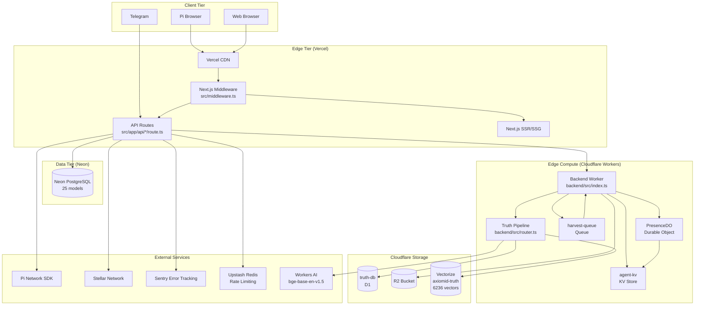
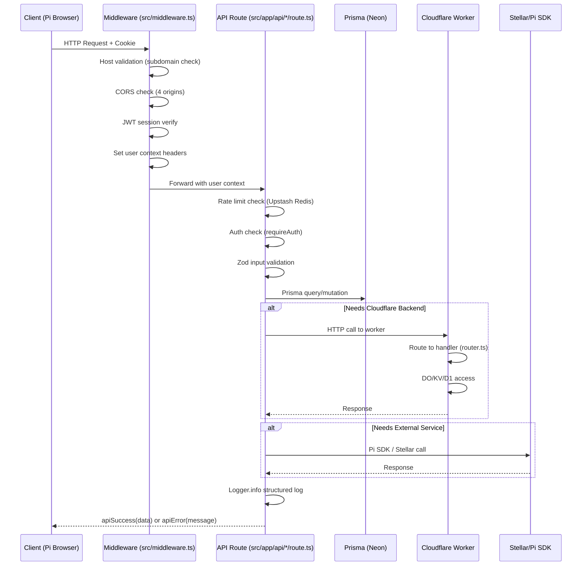

# Runtime Architecture — System Context & Component Interaction

- **Version:** 1.0
- **Generated:** 2026-07-13
- **Agent:** Delta (Phase 3)
- **Confidence:** 97%
- **Sources:** `src/middleware.ts`, `src/app/api/*/route.ts`, `backend/src/router.ts`, `backend/src/index.ts`, `backend/wrangler.toml`, `prisma/schema.prisma`, `next.config.ts`, `package.json`
- **Last Verified:** 2026-07-13

## High-Level Architecture

## Request Flow (Typical Authenticated Request)

## Component Responsibilities

### Vercel Tier (Next.js)
| Component | File | Responsibility |
|-----------|------|---------------|
| Edge Middleware | `src/middleware.ts` | CORS, host validation, JWT auth, cookie management |
| API Routes | `src/app/api/*/route.ts` | Request handling, validation, orchestration |
| Next.js SSR | `src/app/**/page.tsx` | Server-side rendering of pages |
| Sentry | `next.config.ts` | Error tracking in Edge/Server/Client |

### Cloudflare Workers Tier
| Component | File | Responsibility |
|-----------|------|---------------|
| Entry Point | `backend/src/index.ts` | Fetch handler, Durable Object export, Queue consumer |
| Router | `backend/src/router.ts` | Request routing (trust, skills, agent, MCP, search, truth) |
| PresenceDO | `backend/src/index.ts:5-50` | User presence tracking via Durable Object |
| Truth Pipeline | `backend/src/router.ts:truth` | RAG pipeline: embed → Vectorize search → D1 fetch → AI generate |

### Data Tier
| Store | Type | Role |
|-------|------|------|
| Neon PostgreSQL | Primary DB | All writes, 25 models, Prisma ORM |
| Cloudflare D1 | Edge DB | Synced subset for low-latency reads |
| Cloudflare R2 | Object Store | Asset storage (passport images, uploads) |
| Cloudflare KV | Cache | Agent dispatch caching |
| Upstash Redis | Rate Limiter | Distributed rate limit counters |

### External Integrations
| Service | Protocol | Purpose |
|---------|----------|---------|
| Pi Network SDK | HTTP + JS SDK | Authentication, payments, ads, KYC, sharing |
| Stellar Network | Horizon REST API | Credential hash anchoring (anchorVcHash) |
| Workers AI | CF Binding | Embedding generation (bge-base-en-v1.5) |
| Vectorize | CF Binding | Semantic vector search |
| Sentry | HTTP | Error tracking and performance monitoring |
