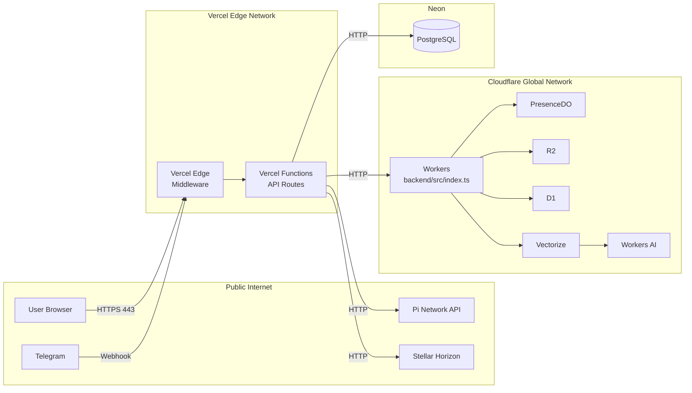

# Runtime Topology — Layer-by-Layer Stack

- **Version:** 1.0
- **Generated:** 2026-07-13
- **Agent:** Delta (Phase 3)
- **Confidence:** 96%
- **Sources:** `package.json`, `backend/wrangler.toml`, `backend/src/index.ts`, `prisma/schema.prisma`, `next.config.ts`, deployment configuration
- **Last Verified:** 2026-07-13

## Stack Overview

```
┌──────────────────────────────────────────────────┐
│                  APPLICATION                     │
│  Next.js 16 + React 19 + Tailwind 4             │
│  Pi SDK v2.0  @pi-network/pi-sdk-v2             │
├──────────────────────────────────────────────────┤
│                  API LAYER                       │
│  Next.js API Routes (55 endpoints)              │
│  Zod validation + Upstash rate limiting         │
│  Pino structured logging + Sentry capture        │
├──────────────────────────────────────────────────┤
│               COMPUTE LAYER                      │
│  Vercel (Edge + Serverless Functions)            │
│  Cloudflare Workers (Durable Objects)            │
├──────────────────────────────────────────────────┤
│                DATA LAYER                        │
│  Neon PostgreSQL (Primary, Prisma ORM)           │
│  Cloudflare D1 (Edge replica)                    │
│  Cloudflare R2 (Object storage)                  │
│  Cloudflare KV (Cache)                           │
│  Upstash Redis (Rate Limiting)                   │
│  Vectorize (Semantic search index)               │
├──────────────────────────────────────────────────┤
│               INFRASTRUCTURE                     │
│  Cloudflare Workers AI (bge-base-en-v1.5)        │
│  Stellar Network (Horizon REST API)              │
│  Pi Network (Auth + Payments + Ads + KYC)        │
│  Sentry (Error tracking)                         │
│  Telegram (Bot webhook)                          │
└──────────────────────────────────────────────────┘
```

## Layer 1: Client Tier

| Property | Value |
|----------|-------|
| Primary Client | Pi Browser (WebView, Chromium-based) |
| Secondary Clients | Standard Web Browsers (Chrome, Safari, Firefox) |
| Telegram | Bot webhook push |
| Protocol | HTTPS (TLS 1.3) |
| Port | 443 |
| Pi SDK | v2.0 — injected via `Pi.init()` in `window.Pi` |
| Fallback | `navigator.share` → clipboard (when Pi native unavailable) |

## Layer 2: Edge Tier (Vercel)

| Property | Value |
|----------|-------|
| Runtime | Node.js 22.x (Serverless), Edge Runtime (Middleware) |
| Framework | Next.js 16.0.0 |
| React | 19.0.0 |
| Tailwind | 4.0.0 |
| Prisma | 6.x |
| Middleware | `src/middleware.ts` — runs on Vercel Edge Runtime |
| API Routes | `src/app/api/*/route.ts` — runs on Vercel Serverless Functions |
| Domain | `axiomid.app` |
| Data Format | JSON (all API responses) |
| Encoding | UTF-8 |

### Key Dependencies (from `package.json`)

| Package | Version | Purpose |
|---------|---------|---------|
| next | 16.0.0 | Framework |
| react / react-dom | 19.0.0 | UI |
| @pi-network/pi-sdk-v2 | ^2.0.0 | Pi integration |
| @axiomid/crypto | workspace:* | Ed25519 keys |
| prisma / @prisma/client | ^6.x | ORM |
| zod | ^3.x | Validation |
| jose | ^5.x | JWT |
| pino | ^8.x | Logging |
| @sentry/nextjs | ^7.x | Error tracking |
| framer-motion | 12.x | Animations |
| tailwindcss | 4.0.0 | CSS |
| @upstash/redis | ^1.x | Rate limiting |

## Layer 3: Compute Tier (Cloudflare Workers)

| Property | Value |
|----------|-------|
| Runtime | Cloudflare Workers (V8 Isolates) |
| Entry File | `backend/src/index.ts` |
| Router File | `backend/src/router.ts` |
| Modules | ES Modules format |
| Compatibility Date | 2024-10-01 (per wrangler.toml) |

### Bindings (from `backend/wrangler.toml`)

| Binding | Type | Resource | Purpose |
|---------|------|----------|---------|
| `PRESENCE_DO` | Durable Object | `PresenceDO` | Online/offline state per user |
| `harvest-queue` | Queue | `harvest-queue` | Async skill execution |
| `agent-kv` | KV Namespace | Agent cache | Dispatch caching |
| `TRUTH_DB` | D1 Database | `truth-db` | Edge SQL for truth data |
| `AXIOMID_TRUTH` | Vectorize Index | `axiomid-truth` | Semantic search (768d, 6236 vectors) |
| `AI` | Workers AI | `@cf/baai/bge-base-en-v1.5` | Embedding generation |
| `R2_BUCKET` | R2 Bucket | AxiomID assets | Object storage |

## Layer 4: Data Tier

### Neon PostgreSQL (Primary)

| Property | Value |
|----------|-------|
| Provider | Neon Serverless PostgreSQL |
| Connection | Pooled via `DATABASE_URL` |
| ORM | Prisma 6.x |
| Models | 25 (User, UserAgent, Stamp, PiPayment, Skill, SkillPipeline, Action, etc.) |
| Pooler | `-pooler` suffix in connection string |
| SSL | `sslmode=require` |

### Cloudflare D1 (Edge Replica)

| Property | Value |
|----------|-------|
| Database | `truth-db` |
| Content | 114 chapters, truth data subset |
| Sync | POST `/api/sync` triggers replication |
| Latency | < 10ms edge reads |

### Upstash Redis

| Property | Value |
|----------|-------|
| Purpose | Rate limiting only |
| Latency | < 5ms |
| Data model | Key: `ratelimit:{identifier}:{endpoint}`, Value: counter |

### Vectorize Index

| Property | Value |
|----------|-------|
| Name | `axiomid-truth` |
| Dimensions | 768 |
| Model | `bge-base-en-v1.5` |
| Vectors | 6236 |
| Contents | 114 chapters of truth data (Arabic + English) |

## Layer 5: External Services

| Service | Protocol | Auth Method | Endpoint |
|---------|----------|-------------|----------|
| Pi Network SDK | HTTP (JS SDK) | API Key + JWT | `api.minepi.com` |
| Stellar Horizon | REST API | None (public) | `horizon.stellar.org` |
| Workers AI | Internal Binding | CF Auth | Workers AI API |
| Sentry | HTTP | DSN | `oXXXXX.ingest.sentry.io` |

## Network Topology



## Data Formats

| Interface | Format | Example |
|-----------|--------|---------|
| API Request | JSON | `{"userId": "abc", "amount": 10}` |
| API Response | JSON | `{"success": true, "data": {...}}` |
| Auth Cookie | JWT (HS256) | `__session=eyJ...` |
| DID Document | JSON-LD | `{"@context": "https://w3id.org/did/v1"}` |
| Passport | JSON + Ed25519 sig | `{"credential": {...}, "proof": {...}}` |
| Pi Payment | JSON (Pi SDK) | `{"identifier": "tx_hash", "amount": 1}` |
| Stellar Tx | XDR (base64) | `AAAAAgAAA...` |
| Sync Payload | JSON | `{"table": "User", "operation": "upsert"}` |
