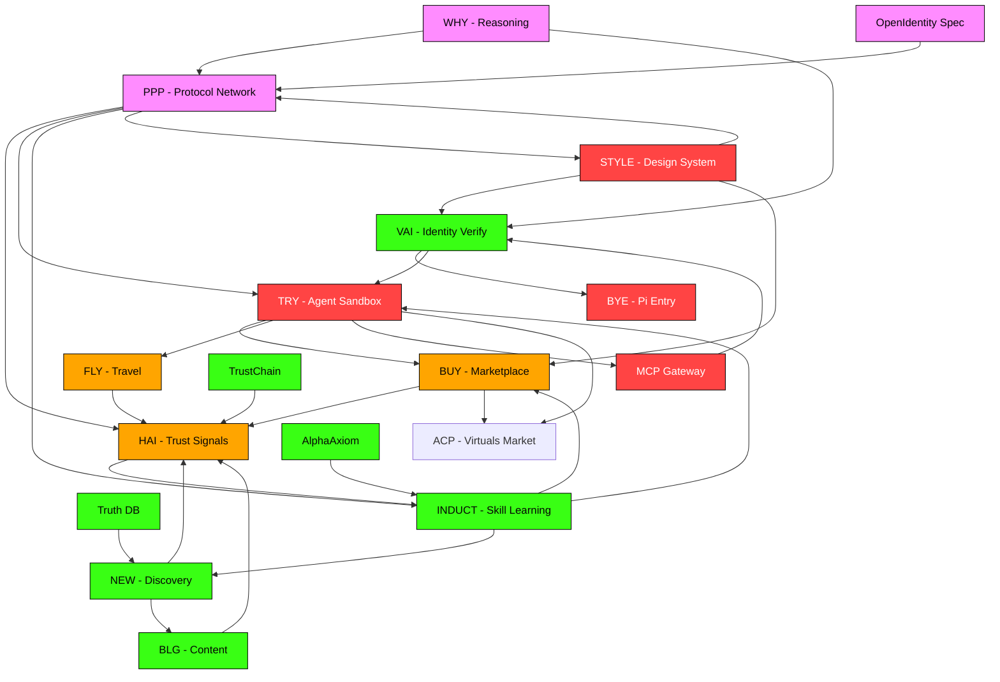

# PAI TOPOLOGY MAP — Global Workspace Architecture

> Inspired by Anthropic's Global Workspace / J-Space research (July 2026)
> "A global workspace in language models" — anthropic.com/research/global-workspace
>
> Applied: PAI Universe topology as a **global workspace for agents**
> Each endpoint = a specialist system. The PPP protocol = the workspace broadcast channel.

---

## 0. CORE INSIGHT FROM ANTHROPIC'S RESEARCH

```
Biological Brain (GWT):        Claude's J-Space:              PAI Architecture:
┌─────────────────────┐       ┌─────────────────────┐       ┌─────────────────────┐
│  Specialist systems │       │  Unconscious procs   │       │  PAI endpoints      │
│  (vision, motor,    │       │  (pattern matching,  │       │  (TRY, BUY, HAI...) │
│   language...)      │       │   feature detect...)  │       │   = specialist sys  │
└────────┬────────────┘       └────────┬────────────┘       └────────┬────────────┘
         │                              │                              │
         ▼                              ▼                              ▼
┌─────────────────────┐       ┌─────────────────────┐       ┌─────────────────────┐
│  GLOBAL WORKSPACE   │       │  J-SPACE             │       │  PPP PROTOCOL       │
│  (broadcast channel)│       │  (Jacobian patterns) │       │  (broadcast layer)  │
│  Limited capacity,  │       │  Silent, broadcast   │       │  Agent state sync   │
│  globally available │       │  to all subsystems   │       │  Discoverable       │
└─────────────────────┘       └─────────────────────┘       └─────────────────────┘

Key properties of a workspace:
  • Globally accessible — any specialist can read/write
  • Limited capacity — only the most relevant content enters
  • Broadcast — written content is visible to all specialists
  • Emergent — the workspace was NOT designed, it emerged during training
```

---

## 1. PAI ECOSYSTEM — FULL TOPOLOGY

### Layer 0: Foundation / Identity (Purple `#6f42c1`)

| Node | Repo | Status | Function | Global Workspace Role |
|------|------|:------:|----------|:---------------------|
| **VAI** | `AxiomID` (main) | 🟢 Live | Identity verification, KYA | **Workspace gatekeeper** — verifies who enters |
| **BYE** | `axiomid-piverify` | 🔴 Empty | Pi Network entry point | **Sensory input** — first contact with external world |

**Gap**: `axiomid-piverify` needs content. Pi SDK integration code exists in AxiomID but no dedicated deployable worker.

### Layer 1: Agent Runtime (Blue `#3178c6`)

| Node | Repo | Status | Function | Global Workspace Role |
|------|------|:------:|----------|:---------------------|
| **TRY** | `pai-agent-kit` | 🔴 Empty | Agent sandbox, experiment, learn | **Motor cortex** — agents take action here |
| **AGENT-CORE** | `pai-mcp` | 🔴 Empty | MCP server — any LLM gets Pi powers | **Sensorimotor** — LLM ↔ Pi bridge |
| **WORKERS** | `PiWorker` | 🟢 Has content | Edge worker services | **Autonomic** — background processes |

**Gap**: `pai-agent-kit` and `pai-mcp` are empty. These are the TWO most critical repos after AxiomID itself.

### Layer 2: Market / Economy (Blue `#3776ab`)

| Node | Repo | Status | Function | Global Workspace Role |
|------|------|:------:|----------|:---------------------|
| **BUY** | (part of AxiomID) | 🟢 Live | Marketplace, transactions | **Reward system** — value exchange |
| **FLY** | (part of AxiomID) | 🟢 Live | Agent travel/booking | **Navigation** — spatial reasoning |
| **ACP** | Virtuals Protocol | 🟢 Live | 22 offerings, 3 subscriptions | **Economy** — external marketplace |

### Layer 3: Truth / Knowledge (Orange `#dea584`)

| Node | Repo | Status | Function | Global Workspace Role |
|------|------|:------:|----------|:---------------------|
| **NEW** | (part of AxiomID) | 🟢 Live | Token detection, discovery | **Novelty detector** — new signals |
| **BLG** | (part of AxiomID) | 🟢 Live | Agentic blog, content | **Episodic memory** — recorded experience |
| **TRUTH_DB** | Cloudflare D1 | 🟢 Live | RAG pipeline, truth index | **Long-term memory** — stored knowledge |

### Layer 4: Trust / Social (Gold `#f7a41d`)

| Node | Repo | Status | Function | Global Workspace Role |
|------|------|:------:|----------|:---------------------|
| **HAI** | (part of AxiomID) | 🟢 Live | Trust signals, ratings, reviews | **Social cognition** — reputation processing |
| **TRUSTCHAIN** | AxiomID core | 🟢 Live | Signed receipts, audit logs | **Conscience** — action recording |

### Layer 5: Self-Play / Evolution (Neon Green `#39FF14`)

| Node | Repo | Status | Function | Global Workspace Role |
|------|------|:------:|----------|:---------------------|
| **INDUCT** | (part of AxiomID) | 🟢 Live | Skill induction, self-improvement | **Learning** — skill acquisition |
| **ALPHA** | `AlphaAxiom` | 🟢 Has content | Research experiments, prototypes | **Imagination** — counterfactual simulation |
| **ALPHA-EDGE** | `AlphaEdge` | 🟢 Has content | Edge computing experiments | **Peripheral** — distributed experimentation |

### Layer 6: Protocol / Meta (Pink `#ff8cff`) — THE WORKSPACE

| Node | Repo | Status | Function | Global Workspace Role |
|------|------|:------:|----------|:---------------------|
| **PPP** | (part of AxiomID) | 🟢 Live | Protocol network — topology index | **GLOBAL WORKSPACE** — broadcast channel |
| **STYLE** | `pai-atom` | 🔴 Empty | Design system, UI primitives | **Presentation** — how workspace content is rendered |
| **WHY** | (part of AxiomID) | 🟢 Live | Philosophical reasoning, purpose | **Metacognition** — self-reflection |
| **OPENID** | `openidentity.md` | 🟢 Has content | OpenIdentity protocol spec | **Constitution** — workspace rules |

**Gap**: `pai-atom` (STYLE) is empty. UI/design system not shipped. Critical for how the workspace presents itself.

---

## 2. ECOSYSTEM SKILLS INDEX

### Internal (PAI-native)

| Skill | Repo | Maturity | Global Workspace Role |
|-------|------|:--------:|:---------------------|
| Identity Passport | AxiomID | 🟢 Beta | **Who** can access workspace |
| TrustChain | AxiomID | 🟢 Beta | **What** happened in workspace |
| Agent Card | AxiomID | 🟢 Beta | **How** agents present in workspace |
| Pi Verify | axiomid-piverify | 🔴 Not shipped | **Auth** for workspace |
| MCP Gateway | pai-mcp | 🔴 Not shipped | **Bridge** to workspace |
| CLI | pai-cli | 🔴 Not shipped | **Terminal** for workspace |
| Atom UI | pai-atom | 🔴 Not shipped | **Visual** of workspace |
| Agent Kit SDK | pai-agent-kit | 🔴 Not shipped | **Runtime** in workspace |
| Skills Registry | pai-skills | 🔴 Not shipped | **Catalog** of workspace tools |
| StartKit | pai-startkit | 🔴 Not shipped | **Template** for workspace apps |

### External (Dependencies)

| Skill | Source | Stars | Workspace Role |
|-------|--------|:-----:|:--------------|
| Ghost.Build | Timescale (Postgres) | 108 | **Storage** layer |
| Kernel.sh | trycua (Browser QA) | 20K+ | **Testing** workspace behavior |
| MCP SDK | modelcontextprotocol | 8.6K | **Protocol** for tool access |
| A2A Protocol | Google | 24.9K | **Agent-to-agent** communication |
| Vercel AI SDK | Vercel | 25.6K | **AI** model access |
| OpenClaw Skills | community | 51K+ | **Skills** marketplace |
| agency-agents | ai-ng | 134K | **Agent** patterns |

---

## 3. GAP ANALYSIS — By Global Workspace Principle

### 🟢 Strengths (Workspace is healthy here)

| Area | Evidence |
|------|----------|
| **Identity layer** (VAI, BYE) | AxiomID has strong DID, TrustChain, passport code |
| **Truth/Knowledge** (NEW, BLG, TRUTH_DB) | RAG pipeline, truth index, D1 databases live |
| **Self-play** (INDUCT, ALPHA) | Skill induction code exists, research repos have content |
| **Protocol/Meta** (PPP, WHY, OPENID) | Topology indexing, OpenIdentity spec, philosophical layer |

### 🟡 Partial Gaps (Workspace exists but weak)

| Area | Issue | Impact |
|------|-------|--------|
| **Market** (BUY, FLY, ACP) | ACP works but not integrated with PAI-native payment | No Pi-based marketplace inside PAI |
| **Trust** (HAI, TRUSTCHAIN) | TrustChain exists but HAI trust signals not deployed | Reputation system in code, not in production |

### 🔴 Critical Gaps (Workspace is missing nodes)

| Missing Node | Missing Repo | Why Critical |
|-------------|-------------|:------------|
| **TRY** (agent runtime) | `pai-agent-kit` empty | Workspace needs agents to **act** — this is the motor cortex |
| **MCP gateway** | `pai-mcp` empty | Workspace needs **sensors** — this is how LLMs interact with Pi |
| **STYLE** (UI) | `pai-atom` empty | Workspace needs **presentation** — how agents see themselves |
| **PiVerify** (auth) | `axiomid-piverify` empty | Workspace needs **ID verification** at entry point |
| **CLI** (dev tools) | `pai-cli` empty | Workspace needs **developer interface** |
| **Skills** (catalog) | `pai-skills` empty | Workspace needs **tool registry** |

### 🔴 Infrastructure Gaps

| Gap | Details | Blocking |
|-----|---------|:--------:|
| **pai.build DNS dead** | NXDOMAIN — domain doesn't resolve | All `pai.build` URLs broken in docs |
| **axiomid.app HTTP 500** | Vercel build failing | Frontend unreachable, API works |
| **No CF_API_TOKEN in CI** | Can't deploy Workers from GitHub Actions | All worker configs are local-only |
| **No R2 credentials** | No image/passport asset storage | Can't serve agent passport photos |
| **No Turnstile** | No bot protection on axiomid.app | Vulnerable to automated abuse |
| **No pre-commit gitleaks** | Security hooks not installed | 22 leaked secrets already detected |

---

## 4. TOPOLOGICAL PREDICTIONS (from the graph)

Using the topology-indexing skill's prediction methodology:

| Gap | Confidence | Why | Missing Edge |
|-----|:----------:|:---|:-------------|
| **INDUCT → BUY** should exist | 85% | Self-play should feed market strategy — agents learn what to buy/sell | `INDUCT → BUY` |
| **BYE → HAI** should exist | 80% | Entry should verify trust immediately | `BYE → HAI` |
| **TRY → ACP** should exist | 85% | Agent sandbox should connect to external marketplace | `TRY → ACP` |
| **MCP → VAI** should exist | 90% | MCP gateway needs identity verification | `MCP → VAI` |
| **STYLE → PPP** exists but empty | 95% | Design system needs content to render workspace | `STYLE → PPP` is an empty pipe |

---

## 5. MASTER TASK LIST (Priority Order)

### Phase 1: Plug Critical Gaps (This Week)

| ID | Task | Repo | Est. | Dependencies |
|:--:|------|------|:----:|:-------------|
| **T1** | Populate `pai-mcp` with the gateway code from `pai/kits/pai-mcp-gateway/` | pai-mcp | 2h | CF_API_TOKEN needed for deploy |
| **T2** | Populate `pai-agent-kit` with agent runtime from `pai/kits/agentkit/` | pai-agent-kit | 2h | — |
| **T3** | Deploy MCP worker to `pai-mcp.amrikyy.workers.dev` | pai-mcp | 1h | T1, CF_API_TOKEN |
| **T4** | Create `pai-list/.github` profile repo with org README | pai-list | 30m | Classic PAT |
| **T5** | Push profile README to `Moeabdelaziz007` profile | profile | 30m | Classic PAT |

### Phase 2: Workspace Infrastructure (This Month)

| ID | Task | Repo | Est. | Dependencies |
|:--:|------|------|:----:|:-------------|
| **T6** | Fix Vercel build → axiomid.app HTTP 200 | AxiomID | 2d | Debug build failure |
| **T7** | Register pai.build DNS in Cloudflare | Domain | 1h | Domain registrar access |
| **T8** | Create CF_API_TOKEN + store in .env + GitHub secrets | AxiomID | 30m | Cloudflare owner access |
| **T9** | Rotate all 22 leaked secrets (see SECURITY_REMEDIATION.md) | All | 1d | Classic PAT |
| **T10** | Set up Turnstile on axiomid.app | AxiomID | 1h | CF_API_TOKEN |
| **T11** | Populate `pai-atom` with design system primitives | pai-atom | 4h | — |
| **T12** | Populate `pai-cli` with CLI code from `pai/kits/` | pai-cli | 3h | — |
| **T13** | Populate `pai-skills` with skills registry from `pai/docs/skills/` | pai-skills | 2h | — |
| **T14** | Populate `pai-startkit` with starter template | pai-startkit | 2h | T2 |
| **T15** | Populate `axiomid-piverify` with Pi verification worker | axiomid-piverify | 3h | CF_API_TOKEN |

### Phase 3: Global Workspace Enhancement (Next Month)

| ID | Task | Repo | Est. | Dependencies |
|:--:|------|------|:----:|:-------------|
| **T16** | Build PPP broadcast protocol — agent state sync via DO | AxiomID | 1w | T2, T6 |
| **T17** | Integrate BYE → HAI edge (entry → trust verification) | AxiomID | 3d | T6 |
| **T18** | Build INDUCT → BUY edge (self-play feeds marketplace) | AxiomID | 4d | T6 |
| **T19** | Add Global Workspace visualization to `/ppp/topology` | AxiomID | 2d | T6, T11 |
| **T20** | Connect TRY → ACP (agent sandbox ↔ marketplace) | AxiomID | 3d | T2, T6 |

### Phase 4: Outreach & Ecosystem (Ongoing)

| ID | Task | Target | Priority |
|:--:|------|--------|:--------:|
| **T21** | Send bhupendra05 email (AION × AxiomID integration) | bhupendra05 | 🅰️ Now |
| **T22** | Reply to Shang — accept $10 trial, express Bedrock interest | AWS Partner | 🅰️ Now |
| **T23** | Follow + DM 0xVertex (datahaven connection) | 0xVertex | 🅰️ Now |
| **T24** | Follow + DM chrisipanaque (agentic systems) | chrisipanaque | 🅰️ Now |
| **T25** | Follow + DM bytenmn (ML engineer) | bytenmn | 🅱️ Week |
| **T26** | Follow + DM Scottcjn (RustChain founder) | Scottcjn | 🅱️ Week |

---

## 6. TOPOLOGY MAP (Mermaid)



---

## 7. WORKSPACE-AS-CODE PRINCIPLES

Anthropic's J-Space teaches us:

```
1. The workspace is EMERGENT — don't over-design it
   → PPP should be minimal. Define edges, let behavior emerge.

2. The workspace is SILENT — it operates in the background
   → Agent state sync should be invisible. No user-facing "PPP is thinking".

3. The workspace BROADCASTS — all specialists can read
   → Every agent can see every other agent's public state.

4. The workspace has LIMITED CAPACITY — only relevant content enters
   → PPP should have a priority queue. Spam = ignored.

5. The workspace CONNECTS STRONGLY — to all subsystems
   → Every PAI endpoint should have a PPP binding.

6. The workspace CAN BE INFLUENCED — to guide decision-making
   → We can inject signals into PPP to steer agent behavior.
```

---

<div align="center">
  <sub>Built with Hermes (Nous Research) — topology-indexing skill — Anthropic Global Workspace research</sub>
  <br>
  <sub>Updated: 21 July 2026 — PAI Universe v0.3.0</sub>
</div>
